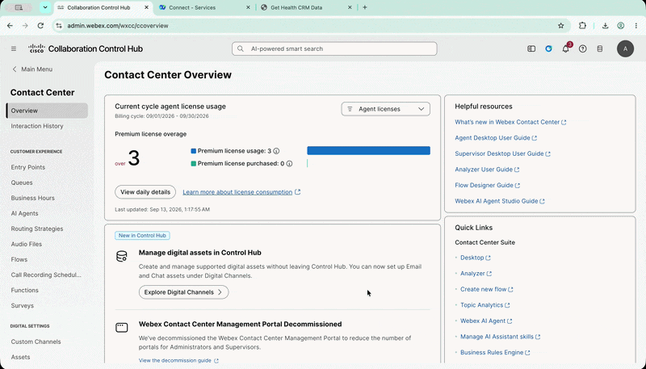
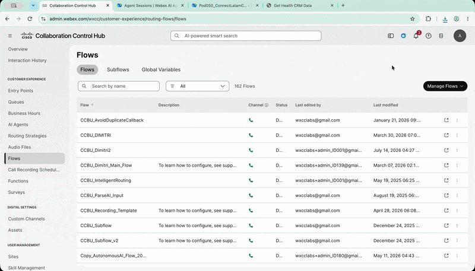
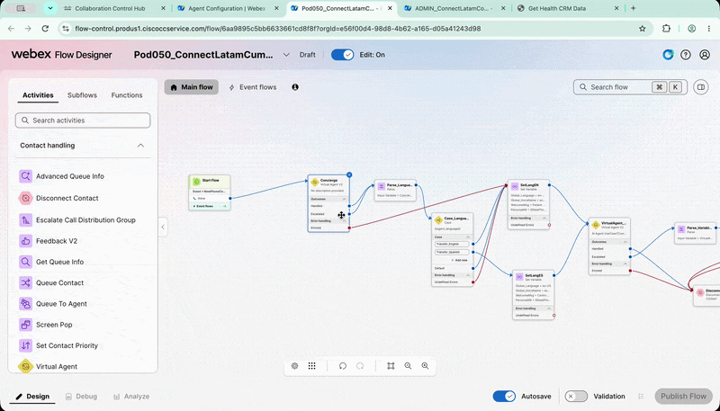
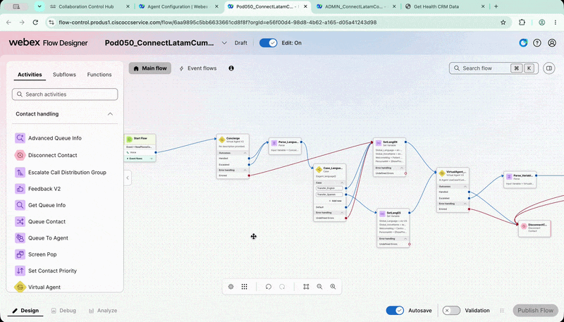
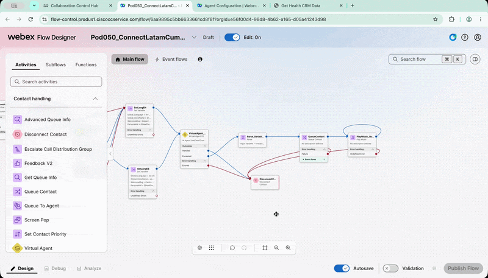
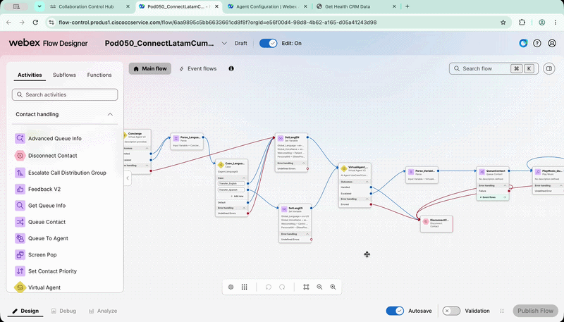
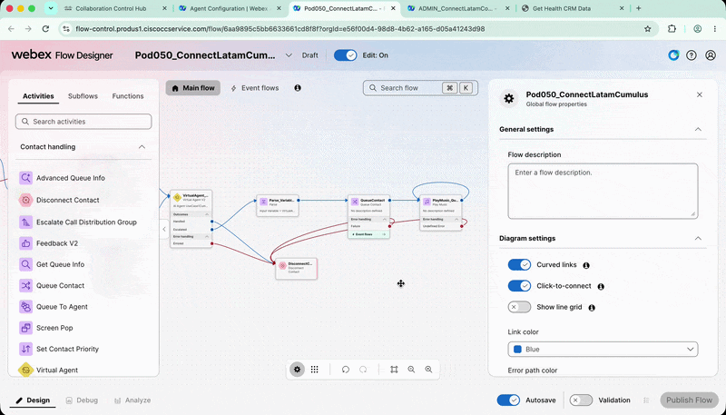
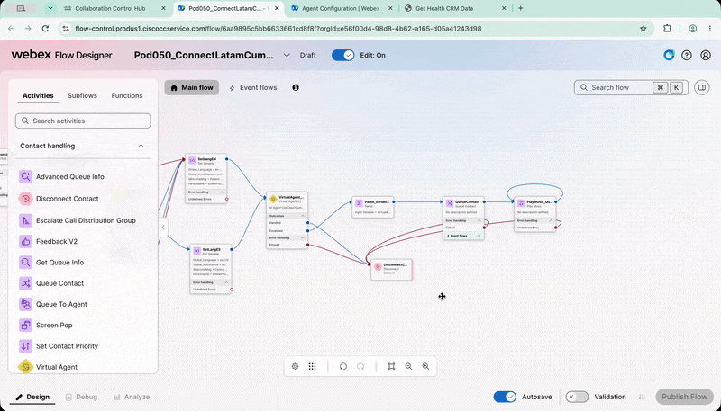
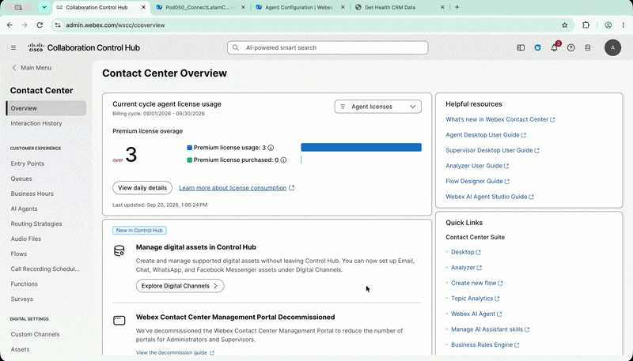

# Lab 3 - Integración de AI Agents con Voice Flow

---

## Agenda

| # | Actividad | Duración |
|---|---|---|
| 3 | Integrar los AI Agents con un `Voice Flow` y realizar una llamada real | 15 minutos |

---

## Objetivo

En este lab utilizarás los AI Agents creados anteriormente en una llamada real.

Configurarás un Voice Flow para:

- Utilizar el `Concierge AI Agent`.
- Detectar el idioma seleccionado por el paciente.
- Transferir la interacción al `Cumulus AI Agent`.
- Pasar variables desde el Voice Flow hacia el AI Agent.
- Recibir variables desde el AI Agent.
- Transferir la llamada a la Queue correspondiente.
- Realizar una llamada real al DID asignado.
- Recibir una confirmación mediante WhatsApp.

---

## 1. Exportar el Voice Flow

1. Ingresa a `Control Hub`.
2. Navega a **Services > Contact Center**.
3. Selecciona **Flows**.
4. Busca el flow:

    ```text
    Admin_ConnectLatamCumulus
    ```

5. Haz clic en los tres puntos ubicados a la derecha del flow.
6. Selecciona **Export**.
7. Guarda el archivo JSON en tu computadora.

???- tip "Exportar el Voice Flow"
    <figure markdown>
        { loading=lazy style="width: 100%; border-radius: 8px; box-shadow: 0 4px 15px rgba(0,0,0,0.2);" }
    </figure>

## 2. Importar el Voice Flow

1. Permanece en `Control Hub > Contact Center > Flows`.
2. Haz clic en **Manage Flows**.
3. Selecciona **Create Flows**.
4. En la nueva ventana, selecciona **Import Flow**.
5. Selecciona el archivo JSON exportado en el paso anterior.
6. Haz clic en **Next**.
7. Asigna el siguiente nombre al nuevo flow:

    ```text
    PODXXX_ConnectLatamCumulus
    ```

    Reemplaza `XXX` por los tres dígitos de tu `Pod ID`.

8. Haz clic en **Create Flow**.
9. Cuando se abra el nuevo flow, haz clic en **Get Started** para comenzar a editarlo.

???- tip "Importar el Voice Flow"
    <figure markdown>
        { loading=lazy style="width: 100%; border-radius: 8px; box-shadow: 0 4px 15px rgba(0,0,0,0.2);" }
    </figure>

## 3. Configurar el Concierge en el Voice Flow

1. Verifica que **Edit On** esté habilitado.
2. Busca el primer nodo `VAV2` llamado:

    ```text
    VirtualAgentConcierge
    ```

3. Haz clic en el nodo para editarlo.
4. En el menú **Virtual Agent**, selecciona el `Concierge AI Agent` que creaste en el Lab 1.

???- tip "Editar el Concierge en el Voice Flow"
    <figure markdown>
        { loading=lazy style="width: 100%; border-radius: 8px; box-shadow: 0 4px 15px rgba(0,0,0,0.2);" }
    </figure>

## 4. Revisar el Parse_Language

5. Continúa revisando el flow hasta encontrar el nodo:

    `Parse_Language`

    Este nodo utiliza el resultado de la selección de idioma realizada en el `Concierge AI Agent`.
    El flow recibe el trigger de transferencia como una variable y configura otras variables que serán utilizadas por el siguiente AI Agent.

!!! warning "No modificar este nodo"
    El nodo `Parse_Language` ya está configurado para el lab. Solo debes revisar cómo utiliza el idioma seleccionado y el trigger de transferencia. No realices cambios.

???- tip "Revisar el trigger de transferencia"
    <figure markdown>
        { loading=lazy style="width: 100%; border-radius: 8px; box-shadow: 0 4px 15px rgba(0,0,0,0.2);" }
    </figure>

## 5. Configurar el Cumulus AI Agent

1. Continúa dentro del Voice Flow.
2. Busca el nodo:

    `VirtualAgent_Cumulus`

3. Haz clic en el nodo para editarlo.
4. En el menú **Virtual Agent**, selecciona el AI Agent creado en el Lab 2:

    ```text
    PODXXX_ConnectLatam_Cumulus
    ```

5. Revisa la sección **Event Data**.

    El flow ya contiene los parámetros y variables que se enviarán al `Cumulus AI Agent`.

    !!! note "Event Data"
        Los parámetros configurados en `Event Data` permiten enviar información desde el Voice Flow hacia el AI Agent, como el mensaje inicial, el idioma seleccionado y el ANI del paciente.

    !!! warning "No modificar Event Data"
        El campo `Event Data` ya está configurado para el lab. No es necesario realizar cambios.

???- tip "Revisar los parámetros de Event Data"
    <figure markdown>
        { loading=lazy style="width: 100%; border-radius: 8px; box-shadow: 0 4px 15px rgba(0,0,0,0.2);" }
    </figure>

## 6. Revisar el nodo Parse_Variables

1. Busca el nodo:

    `Parse_Variables`

2. Haz clic en el nodo para revisar su configuración.

    Este nodo recibe variables del AI Agent cuando la interacción regresa al Voice Flow.

    En este caso, se configuran las siguientes variables: `patient_name` y `requirement`. <br>


    Estas variables se utilizarán para mostrar información en el `Agent Desktop`.

!!! warning "No modificar este nodo"
    El nodo `Parse_Variables` ya está configurado para el lab. Solo revisa cómo recibe la información del AI Agent. No realices cambios.

???- tip "Revisar las variables de salida"
    <figure markdown>
        { loading=lazy style="width: 100%; border-radius: 8px; box-shadow: 0 4px 15px rgba(0,0,0,0.2);" }
    </figure>

## 7. Configurar la Queue

1. Busca el nodo **Queue**.
2. Haz clic en el nodo para editarlo.
3. En la lista de queues, selecciona:

    `PodXXX_Cumulus_ES`

    Esta configuración garantiza que, cuando el paciente solicite hablar con un agente humano, la llamada sea enviada al `Agent Desktop` correspondiente.

???- tip "Configurar la Queue del Voice Flow"
    <figure markdown>
        { loading=lazy style="width: 100%; border-radius: 8px; box-shadow: 0 4px 15px rgba(0,0,0,0.2);" }
    </figure>

## 8. Validar y publicar el Voice Flow

1. Activa **Validation** en la parte inferior del flow.
2. Espera a que la validación finalice.
3. Verifica que no existan errores.
4. Haz clic en **Publish Flow**.
5. Cuando aparezca la confirmación, haz clic nuevamente en **Publish Flow**.

???- tip "Publicar el Voice Flow"
    <figure markdown>
        { loading=lazy style="width: 100%; border-radius: 8px; box-shadow: 0 4px 15px rgba(0,0,0,0.2);" }
    </figure>

## 9. Asociar el Voice Flow al Entry Point

Ahora asociarás el Voice Flow publicado con el DID que utilizarás para realizar la llamada.

1. Regresa a `Control Hub`.
2. Navega a **Services > Contact Center**.
3. Selecciona **Entry Point**.
4. Busca el siguiente Entry Point:

    `PodXXX_Cumulus_Voice`

    !!! warning "Seleccionar el Entry Point correcto"
        Asegúrate de seleccionar el Entry Point de tipo **Voice**.

5. Haz clic en el Entry Point.
6. En **Routing Flow**, selecciona el Voice Flow que publicaste anteriormente.
7. En **Music on hold**, selecciona: `defaultmusic_on_hold.wav`
8. En **Version label**, selecciona: `Latest`
9. Haz clic en **Save**.

???- tip "Configurar el Entry Point"
    <figure markdown>
        { loading=lazy style="width: 100%; border-radius: 8px; box-shadow: 0 4px 15px rgba(0,0,0,0.2);" }
    </figure>

## 10. Realizar una llamada de prueba

1. Realiza una llamada al DID asignado a tu Pod.
2. Puedes utilizar tu teléfono celular.
3. También puedes iniciar sesión en la `Webex App` con el usuario adicional asignado a tu Pod y realizar la llamada desde allí.
4. Selecciona el idioma cuando el Voice Flow lo solicite.
5. Después de seleccionar el idioma, la llamada será enviada al `Cumulus AI Agent`.

Si realizas la llamada desde un teléfono celular válido, recibirás un mensaje de WhatsApp con la confirmación de la cita.

## 11. Script de prueba

1. Utiliza el siguiente script para validar la experiencia completa:

    ```text
    BOT: Centro de Atención al Paciente del Hospital Cumulus. Déjame saber cómo te ayudo hoy.

    PACIENTE: Yo quiero agendar una cita.

    BOT: Por favor, dime tu identificador de paciente de tres cifras.

    PACIENTE: Cero Diez.

    BOT: Estoy buscando tu expediente con tu identificador de paciente. Un momento, por favor.

    BOT: Gracias. Ahora necesito tu fecha de nacimiento para verificar tu identidad.

    PACIENTE: 1 de enero de 1990.

    BOT: Perfecto, gracias por la información. Esa fecha corresponde al primero de enero de mil novecientos noventa. ¿La confirmas?

    PACIENTE: Es correcto.

    BOT: Perfecto, tu identidad ha sido verificada. ¿En qué puedo ayudarte con tu cita?

    PACIENTE: Quiero cambiar mi cita.

    BOT: Claro. Para cambiar tu cita necesito la ubicación, la especialidad, la fecha y la hora que deseas.

    PACIENTE: Quiero una cita de pediatría en Cancún.

    BOT: En Cancún hay pediatría. Me falta la fecha y la hora que deseas. Las citas están disponibles de lunes a viernes, en punto.

    PACIENTE: A las 9 de la mañana.

    BOT: Perfecto. ¿Qué fecha deseas?

    PACIENTE: El 2 de octubre.

    BOT: Confirmo pediatría en Cancún, el 2 de octubre de 2026 a las 9 de la mañana. ¿Es correcto?

    PACIENTE: Sí, es correcto.

    BOT: Perfecto, gracias por confirmar. Estoy cambiando tu cita de pediatría en Cancún para el 2 de octubre de 2026 a las 9 de la mañana. Dame un momento.

    BOT: Estoy enviando la confirmación de tu cita por WhatsApp.

    BOT: Tu cita ha quedado cambiada para pediatría en Cancún el 2 de octubre de 2026 a las 9 de la mañana. También te he enviado un mensaje de confirmación. ¿Necesitas algo más?

    PACIENTE: No, eso es todo. Gracias.

    BOT: De nada. Que tengas un buen día.
    ```

2. Verifica que:

    - El paciente pueda seleccionar el idioma.
    - El `Concierge AI Agent` transfiera correctamente la interacción.
    - El `Cumulus AI Agent` reciba las variables del Voice Flow.
    - El paciente sea autenticado antes de consultar o modificar información.
    - La cita se actualice correctamente.
    - Se envíe el mensaje de WhatsApp.
    - La llamada regrese al Voice Flow cuando corresponda.
    - La llamada pueda ser enviada a la `Queue` configurada.

!!! note "Transferencia a un agente humano"
    La habilitación de `Agent handover` y la experiencia de asistencia con `AI Assistant` se realizarán en el **Bonus Lab**.

---

## 🏁 Lab 3 Completado — Felicitaciones! 🎉

Has integrado los **AI Agents** con un **Voice Flow**, realizado una llamada real y validado el envío de la confirmación por WhatsApp.

---

*Lab realizado para Cisco Connect Latam 2026*
