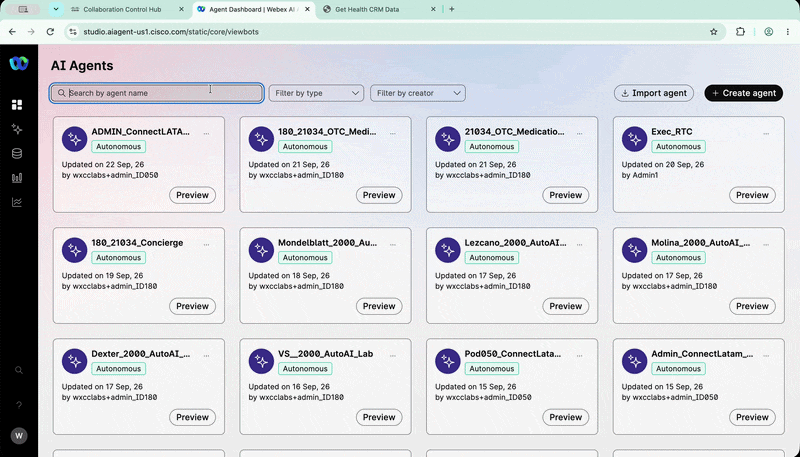
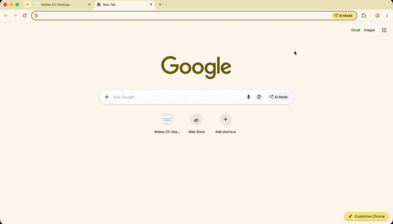
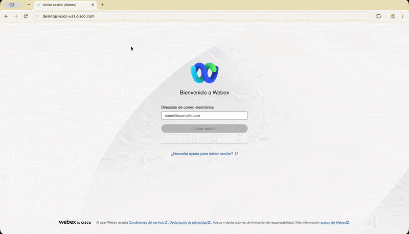
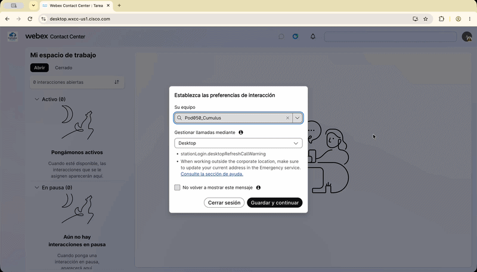
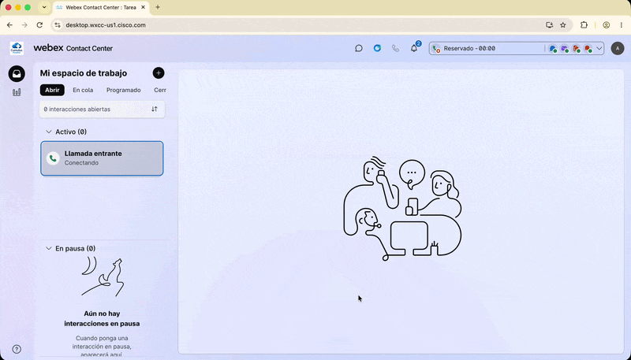

# Bonus Lab - AI Assistant: Asistencia al agente humano

---

## Agenda

| # | Actividad | Duración |
|---|---|---|
| Bonus | Habilitar `Agent handover` y utilizar `AI Assistant` con `Real-Time Assist` en Agent Desktop | 5 minutos |

---

## Objetivo

En escenarios reales, un AI Agent puede necesitar transferir la interacción a un agente humano cuando recibe una solicitud compleja o fuera de su alcance.

En este Bonus Lab habilitarás `Agent handover` y utilizarás `AI Assistant` con `Real-Time Assist` para apoyar al agente humano durante una llamada.

---

## 1. Habilitar Agent handover

1. Abre `AI Agent Studio`.
2. Selecciona el `Cumulus AI Agent` creado para tu Pod:

    ```text
    PodXXX_ConnectLatam_Cumulus
    ```

3. Abre la pestaña **Actions**.
4. Habilita la acción **Agent handover**.
5. Haz clic en **Publish**.
6. Agrega una nueva nota de versión, por ejemplo:

    ```text
    Bonus Lab - Enable Agent Handover
    ```

7. Confirma la publicación.

???- tip "Habilitar Agent handover"
    <figure markdown>
        { loading=lazy style="width: 100%; border-radius: 8px; box-shadow: 0 4px 15px rgba(0,0,0,0.2);" }
    </figure>

!!! note "Agent handover"
    Al habilitar `Agent handover`, el `Cumulus AI Agent` podrá transferir la llamada a un agente humano cuando el paciente lo solicite o cuando la interacción requiera asistencia adicional.

## 2. Configurar Chrome en español

Para que `Agent Desktop` muestre correctamente la interfaz en español, abre una nueva ventana de Chrome utilizando el perfil correspondiente al agente.

1. Abre una nueva ventana de Chrome con el perfil `Agent`.
2. Haz clic en el menú de tres puntos ubicado en la esquina superior derecha.
3. Selecciona **Settings**.
4. En el buscador de configuración, escribe:

    ```text
    Language
    ```

5. Ubica **Spanish** en la lista de idiomas.
6. Si Spanish no aparece como idioma principal, haz clic en los tres puntos junto a Spanish.
7. Selecciona **Move to the top**.

???- tip "Configurar Chrome en español"
    <figure markdown>
        { loading=lazy style="width: 100%; border-radius: 8px; box-shadow: 0 4px 15px rgba(0,0,0,0.2);" }
    </figure>

## 3. Iniciar sesión en Agent Desktop

1. Desde Chrome, abre [Agent Desktop](https://desktop.wxcc-us1.cisco.com/).
2. Inicia sesión utilizando las credenciales de `Agent` asignadas a tu Pod.

    ???- tip "Iniciar sesión en Agent Desktop"
        <figure markdown>
            { loading=lazy style="width: 100%; border-radius: 8px; box-shadow: 0 4px 15px rgba(0,0,0,0.2);" }
        </figure>

3. Mantén la configuración predeterminada en la ventana de inicio de sesión.
4. Haz clic en **Guardar y continuar**.
5. Si el sistema solicita permiso para utilizar el sonido, habilítalo.

## 4. Poner el agente en estado Available

1. En `Agent Desktop`, verifica que el usuario esté conectado correctamente.
2. Cambia el estado del agente a:`Available`

    El agente debe estar disponible para recibir la llamada transferida por el `Cumulus AI Agent`.

???- tip "Poner el agente en estado Available"
    <figure markdown>
        { loading=lazy style="width: 100%; border-radius: 8px; box-shadow: 0 4px 15px rgba(0,0,0,0.2);" }
    </figure>

## 5. Realizar la llamada y solicitar transferencia

1. Realiza una llamada al DID asignado a tu Pod utilizando tu teléfono celular.
2. También puedes utilizar la `Webex App` con el usuario asignado a tu Pod.
3. Selecciona el idioma solicitado por el Voice Flow.
4. Interactúa con el `Cumulus AI Agent`.
5. Utiliza uno de los escenarios practicados anteriormente, por ejemplo:

    `Cancelar una cita` <br>
    `Cambiar una cita` <br>
    `Consultar información sobre Cumulus Hospital` <br>
    `Solicitar hablar con un agente humano` <br>

6. Durante la conversación, solicita explícitamente la transferencia a un agente humano.

    Ejemplo: `Quiero hablar con un agente humano.`

    El **Cumulus AI Agent** debe ejecutar **Agent handover** y transferir la llamada a la Queue configurada.

## 6. Utilizar AI Assistant

Cuando el agente humano reciba la llamada:

1. En `Agent Desktop`, abre **AI Assistant**.
2. Haz clic en **Get Suggestion**.
3. Permite que `Real-Time Assist` escuche la conversación entre el paciente y el agente.
4. Continúa la conversación con el paciente.

    Puedes preguntar, por ejemplo: `¿Cuáles son las ubicaciones de Cumulus Hospital?`

5. Observa las sugerencias que aparecen en `AI Assistant`.
6. Verifica que la respuesta sugerida esté basada en el Knowledge Base configurado para el caso de uso.

???- tip "Utilizar AI Assistant en Agent Desktop"
    <figure markdown>
        { loading=lazy style="width: 100%; border-radius: 8px; box-shadow: 0 4px 15px rgba(0,0,0,0.2);" }
    </figure>

!!! note "Real-Time Assist"
    `Real-Time Assist` utiliza el contexto de la conversación para proporcionar sugerencias al agente humano en tiempo real.
    Estas sugerencias pueden ayudar al agente a responder preguntas utilizando la información disponible en el Knowledge Base.

## 7 Resultado esperado

Al finalizar este Bonus Lab debes haber comprobado que:

- El `Cumulus AI Agent` puede transferir una llamada a un agente humano.
- La llamada llega correctamente al `Agent Desktop`.
- El agente puede utilizar `AI Assistant`.
- `Real-Time Assist` analiza la conversación en tiempo real.
- Las sugerencias se generan utilizando el Knowledge Base.
- El agente humano recibe apoyo contextual durante la interacción.

---

## 🏁 Bonus Completado — Felicitaciones! 🎉

Has habilitado **Agent handover**, transferido una llamada desde el AI Agent hacia un agente humano y utilizado **AI Assistant** con **Real-Time Assist**.

---

*Lab realizado para Cisco Connect Latam 2026*