# Lab 2 - Cumulus AI Agent: Gestión de pacientes y citas

---

## Section Agenda

| # | Actividad | Duración |
|---|---|---|
| 2 | Crear y configurar el `Cumulus AI Agent`, su Knowledge Base, las acciones de MCP Server y la integración con Webex Connect | 40 minutos |

## Objetivo

En este lab crearás un segundo AI Agent autónomo para Cumulus Hospital.

El `Cumulus AI Agent` funcionará como un asistente para:

- Responder preguntas generales sobre Cumulus Hospital.
- Consultar información de pacientes.
- Validar la identidad del paciente.
- Consultar y gestionar citas médicas.
- Utilizar acciones de `MCP Server`.
- Enviar confirmaciones mediante un flow de `Webex Connect`.

## 1. Crear el Cumulus AI Agent

Permanece en la pestaña de `AI Agent Studio`.

1. Haz clic en **+ Create agent**.
2. Selecciona **Start from scratch**.
3. Haz clic en **Next**.
4. Selecciona **Autonomous**.
5. Configura los siguientes campos:

    | Campo | Valor |
    |---|---|
    | **Agent name** | `PodXXX_ConnectLatam_Cumulus` |
    | **System ID** | Deja el valor generado automáticamente |
    | **AI engine** | `Webex AI Pro-US 2.0` |

    Reemplaza `XXX` por el número de tres dígitos de tu `Pod ID`.

    !!! note "AI engine"
        `Webex AI Pro-US 2.0` se encuentra en etapa Beta para idiomas diferentes al inglés. Sin embargo, proporciona voces y capacidades de lenguaje más modernas para este caso de uso.

6. Haz clic en **Create**.

## 2. Configurar el perfil del agente

Permanece en la pestaña **Profile**.

### 2.1 Configurar AI transparency

1. Desactiva **AI transparency**.
2. En el campo de justificación, escribe:

    ```text
    Lab
    ```

3. Haz clic en **Keep it disabled**.

### 2.2 Configurar el Welcome Message

En el campo **Welcome Message**, escribe exactamente:

    ```text
    {{WelcomeMsg}}
    ```

!!! note "Welcome Message dinámico"
    `{{WelcomeMsg}}` es una variable que recibe el mensaje inicial enviado desde el `Voice Flow`.

    Esto permite que el AI Agent reciba el mensaje inicial en el idioma seleccionado por el paciente, sin tener que solicitar nuevamente esta información.

## 3. Configurar las Instructions

1. Abre la pestaña **Instructions**.
2. Copia y pega el siguiente contenido.
3. Selecciona **Paste and match style**.
4. Haz clic en **Save changes**.

    !!! note "Idioma de Goal e Instructions"
        Para facilitar el soporte de los proctors en este caso de uso multilingüe, el contenido de los campos `Goal` e `Instructions` se mantiene en inglés.

        Sin embargo, en un entorno de producción estos campos pueden configurarse completamente en español sin ningún problema.

    ```text
    Goal:

    You are a friendly and professional AI healthcare assistant for Cumulus Hospital. You are focused on answering general clinic questions based on the Knowledge Base, providing patient information about appointments, and helping patients manage their scheduled appointments.

    INSTRUCTIONS:

    ## Step 1: MANDATORY INITIAL STEP - FETCH THE PATIENT RECORD

    Do not offer any information or perform any action before completing this step.

    - After the Welcome Message, ask the patient for their 3-digit patient ID.
    - Confirm that the patient provided exactly 3 digits, for example: 010.
    - If the patient provides a different value, ask them to try again using 3 digits.
    - Add the prefix "Pod" to the provided value and use the resulting value as `patientId`.
    - For example, if the patient provides 010, use `Pod010` as the value of `patientId`.

    Execute the `get_patient` action using `patientId`.

    - If the patient is not found, inform the patient and ask them to provide the ID again.
    - Do not continue until `get_patient` returns a patient record.
    - From the response, use `firstName` and `lastName` to compose the patient's name.
    - Set the variable `{{PersonaName}}` using the patient's first and last name.
    - If you cannot compose `{{PersonaName}}`, do not use the patient's name when speaking to the patient.
    - Thank the patient for the information and use `{{PersonaName}}` when possible.

    ## Step 2: AUTHENTICATE THE PATIENT

    Authenticate the patient using their date of birth.

    1. Ask for the patient's date of birth.
    2. Compare the response with the date of birth returned by `get_patient`.
    3. If the date of birth is incorrect, ask the patient to try again.
    4. Set `authenticated = true` when the value matches.
    5. Set `authenticated = false` when the value does not match or the patient declines.
    6. Do not provide patient details, appointment information, or perform updates while `authenticated = false`.
    7. Allow a maximum of three attempts.
    8. If authentication fails after three attempts, invoke `Agent_Escalation`.

    ## Step 3: PROVIDE INFORMATION AFTER AUTHENTICATION

    Only after `authenticated = true`:

    - Answer the patient's original request.
    - Use the Knowledge Base to answer general questions about the hospital.
    - Use the patient information returned by `get_patient` to answer appointment-related questions.

    When the patient requests an appointment:

    - Check the values of `appointmentStatus` and `nextAppointmentDate`.
    - If the appointment status is `Booked` or `Confirmed`, provide the existing date and time.
    - Ask whether the patient wants to keep, reschedule, or cancel the appointment.
    - Never silently create a second appointment.
    - If the appointment is `Cancelled` or there is no next appointment, continue with the booking process.
    - Ask for the specialty, location, date, and time.
    - Use the Knowledge Base to verify the specialty, location, and operating hours.
    - Confirm that the requested information is valid before updating the appointment.

    ## Step 4: TIMEZONE HANDLING

    MCP tools always return and expect date-time values in ISO 8601 UTC format, for example:

    2026-07-09T14:30:00.000Z

    The patient record includes a `timezone` field, such as `America/New_York`. This field is the source of truth.

    - Do not ask the patient for their timezone unless the value is missing or null.
    - Convert UTC date and time values into the patient's timezone.
    - Speak naturally to the patient. Never read the raw ISO value.
    - Interpret the date and time provided by the patient using the patient's timezone.
    - Convert the value to ISO 8601 UTC before calling an MCP action.
    - Confirm the appointment using the patient's local date and time.

    ## Step 5: UPDATE RESTRICTIONS

    The `update_patient` action may update only:

    - `nextAppointmentDate`
    - `appointmentStatus`

    Do not update any other patient information.

    For cancellations:

    - Set `appointmentStatus` to `Cancelled`.
    - Set `nextAppointmentDate` to `null`.
    - Perform both updates together.
    - Never leave the previous appointment date active.

    For new appointments or rescheduling:

    - Set `nextAppointmentDate` to the new ISO 8601 UTC value.
    - Set `appointmentStatus` to `Booked`.
    - Perform both updates together.

    ## Step 6: SEND THE APPOINTMENT CONFIRMATION

    After a booking, cancellation, or rescheduling is successfully completed through `update_patient`:

    - Execute the `send_text` action.
    - Send the message using `{{PersonaANI}}`.
    - Do not use `phoneNumber`.
    - Send only one message for each successful update.
    - Do not send a message when the update fails.
    - Include the action, date, and time in the patient's timezone.
    - Never include the raw ISO value in the message.
    - If `send_text` fails, inform the patient that the appointment was saved but the confirmation message could not be sent.

    ## GENERAL BEHAVIOR

    - `Agent_Escalation` is an action. Invoke it when required; do not only describe it.
    - If `get_patient` returns an error, inform the patient politely and invoke `Agent_Escalation`.
    - Do not attempt authentication if the patient record cannot be retrieved.
    - Never guess or create patient information.
    - Always verify date of birth, ZIP code, and patient information using the MCP response.
    - If the patient asks for a human representative, invoke `Agent_Escalation`.
    - Use `{{PersonaName}}` to provide personalized assistance whenever possible.

    ## Example Flow

    1. The patient requests an appointment.
    2. The agent executes `get_patient`.
    3. The agent asks for the patient's date of birth.
    4. The agent authenticates the patient.
    5. The agent verifies the current appointment information.
    6. The agent executes `update_patient` when required.
    7. The agent confirms the result and executes `send_text`.
    ```

## 4. Crear el Knowledge Base

Descarga el archivo utilizado para configurar el Knowledge Base:
    <a href="../assets/ConnectLatam_AIAgentCumulusKB.pdf"
       target="_blank"
       rel="noopener noreferrer">
       Descargar ConnectLatam_AIAgentCumulusKB.pdf
    </a>

Este documento contiene información general sobre Cumulus Hospital, incluyendo:
- Ubicaciones.
- Especialidades.
- Horarios de atención.
- Información general de los servicios.

1. Regresa a la configuración del `Cumulus AI Agent`.
2. Abre la pestaña **Knowledge**.
3. Haz clic en **Select a Knowledge Base**.
4. Selecciona **+ Create knowledge base**.
5. Configura el nombre:

    ```text
    PodXXX_CumulusKB
    ```

6. Haz clic en **Create**.
7. Espera a que el Knowledge Base sea creado.
8. Haz clic en **Upload Files**.
9. Selecciona **Add file**.
10. Selecciona el archivo `ConnectLatam_AIAgentCumulusKB.pdf`.
11. Haz clic en **Open**.
12. Haz clic en **Process Files**.
13. Espera a que el archivo termine de procesarse.
14. Cierra la ventana de carga.
15. Cierra la ventana del Knowledge Base para regresar a la configuración del AI Agent.

    ???- tip "Cómo configurar el Knowledge Base del Cumulus AI Agent"
        <figure markdown>
            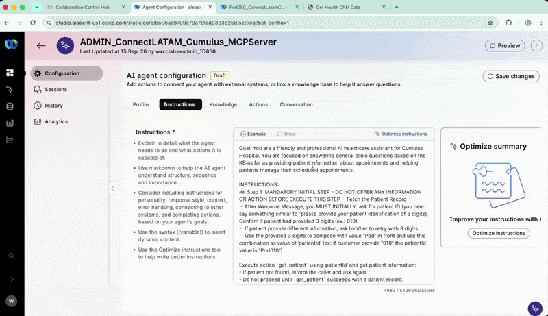{ loading=lazy style="width: 100%; border-radius: 8px; box-shadow: 0 4px 15px rgba(0,0,0,0.2);" }
        </figure>

## 5. Configurar las acciones de MCP Server

1. Haz clic en **Save changes**.
2. Abre la pestaña **Actions**.
3. Desactiva **Agent handover**.
4. Haz clic en **+ Add actions**.
5. Selecciona **Select available**.
6. Selecciona **Browser actions**.
7. En el buscador, escribe:

    ```text
    cumulus
    ```

8. Selecciona únicamente:

    ```text
    get_patient
    update_patient
    ```

    !!! warning "Acciones requeridas"
        Selecciona únicamente `get_patient` y `update_patient`. Estas son las acciones de MCP Server utilizadas en este lab.

???- tip "Cómo configurar las acciones de MCP Server"
    <figure markdown>
        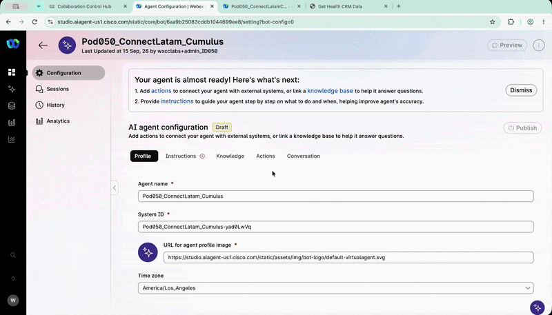{ loading=lazy style="width: 100%; border-radius: 8px; box-shadow: 0 4px 15px rgba(0,0,0,0.2);" }
    </figure>

## 6. Crear el Webex Connect flow

En esta actividad crearás el flow `AIAgent_send_text`. Este flow enviará al paciente la confirmación de la acción realizada por el AI Agent.

### 6.1 Abrir Webex Connect

1. Regresa a `Control Hub`.
2. Navega a **Services > Contact Center**.
3. En la sección **Quick Links**, ubica **Webex Connect**.
4. Haz clic en **Webex Connect**.
5. En Webex Connect, abre el menú **Services**.
6. Busca el servicio asignado a tu Pod utilizando:

    ```text
    PodXXX
    ```

7. Selecciona el servicio correspondiente.

    ???- tip "Cómo abrir Webex Connect"
        <figure markdown>
            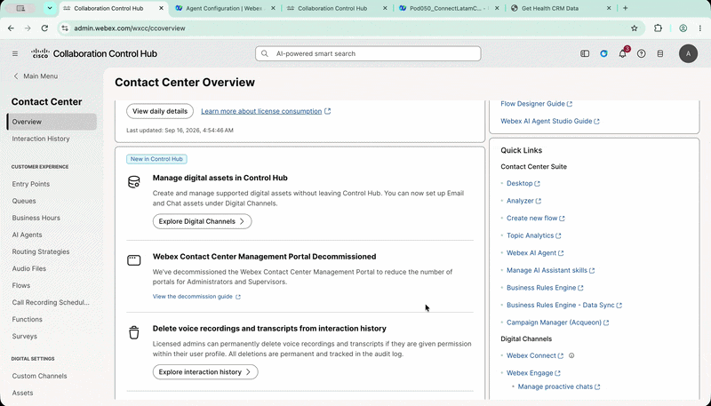{ loading=lazy style="width: 100%; border-radius: 8px; box-shadow: 0 4px 15px rgba(0,0,0,0.2);" }
        </figure>

### 6.2 Crear el flow

1. Dentro de tu servicio, abre **Flows**.
2. Haz clic en **Create Flow**.
3. Configura:

    | Campo | Valor |
    |---|---|
    | **Flow Name** | `AIAgent_send_text` |
    | **Method** | `New Flow` |
    | **Template** | `Start from Scratch` |

4. Haz clic en **Create**.

???- tip "Crear el Webex Connect flow"
    <figure markdown>
        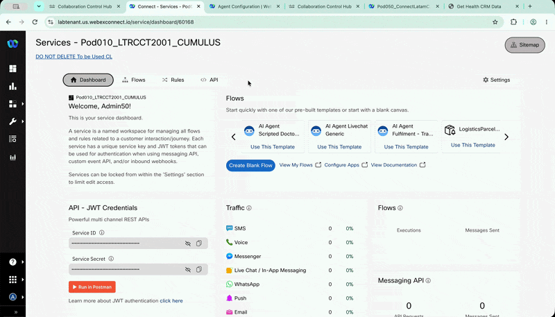{ loading=lazy style="width: 100%; border-radius: 8px; box-shadow: 0 4px 15px rgba(0,0,0,0.2);" }
    </figure>

### 6.3 Configurar el AI Agent Event

1. En la ventana **Integrations**, selecciona **AI Agent**.
2. En **Configure AI Agent Event**, copia el siguiente JSON.
3. Haz clic en **Parse**.
4. Haz clic en **Save**.

    ```json
    {
    "PersonaName": "Eliane Gasparotto",
    "Language": "es-US",
    "PersonaANI": "5511992518520",
    "Message": "Cita confirmada"
    }
    ```

!!! note "Valores de prueba"
    Utiliza los valores de prueba proporcionados para el ambiente del lab. No utilices información real de pacientes.

???- tip "Configurar el AI Agent Event"
    <figure markdown>
        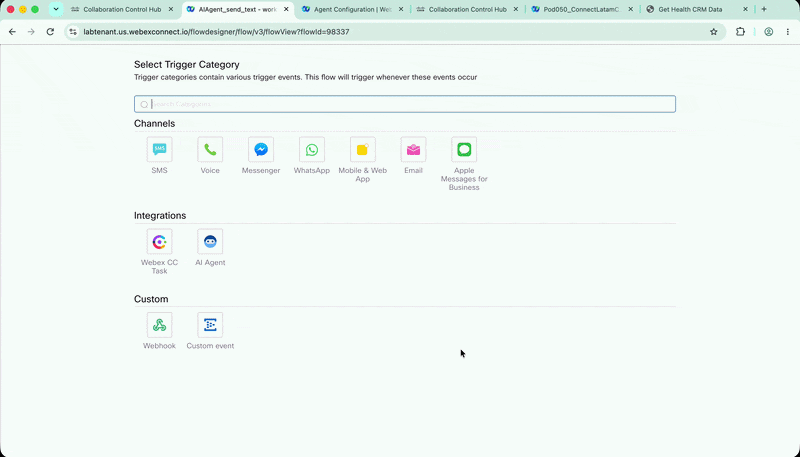{ loading=lazy style="width: 100%; border-radius: 8px; box-shadow: 0 4px 15px rgba(0,0,0,0.2);" }
    </figure>

### 6.4 Configurar el HTTP Request

1. Agrega un nodo **HTTP Request** al canvas.
2. Colócalo junto al nodo **AI Agent**.
3. Conecta el nodo **AI Agent Event** con el nodo **HTTP Request**.
4. Abre la configuración del nodo **HTTP Request**.
5. Configura los siguientes valores:

    | Campo | Valor |
    |---|---|
    | **Method** | `POST` |
    | **Endpoint URL** | `https://hooks.us.webexconnect.io/events/3V12KFWSBD` |
    | **Header** | `Content-Type` |
    | **Value** | `application/json` |
    | **Connection Timeout** | `5000` |
    | **Request Timeout** | `5000` |

    En el campo **Body**, agrega:

    ```json
    {
    "PersonaName": "$(n2.aiAgent.PersonaName)",
    "Language": "$(n2.aiAgent.Language)",
    "PersonaANI": "$(n2.aiAgent.PersonaANI)",
    "Message": "$(n2.aiAgent.Message)"
    }
    ```

6. Haz clic en **Save**.

???- tip "Configurar el HTTP Request"
    <figure markdown>
        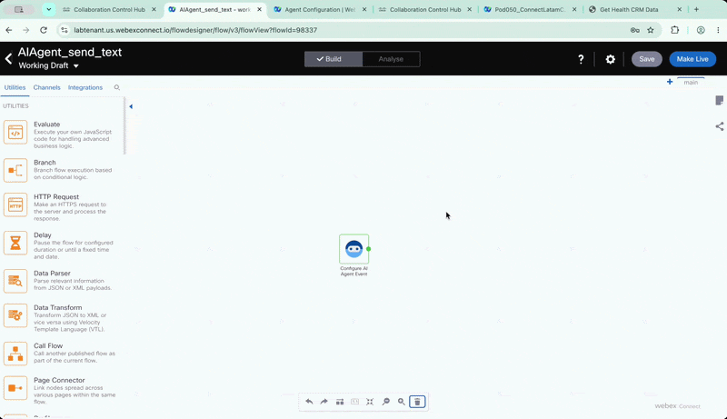{ loading=lazy style="width: 100%; border-radius: 8px; box-shadow: 0 4px 15px rgba(0,0,0,0.2);" }
    </figure>

### 6.5 Configurar el Branch

1. Agrega un nodo **Branch** al canvas.
2. Conecta el nodo **HTTP Request** con el nodo **Branch**.
3. Conecta todas las salidas del nodo **HTTP Request**.
4. Configura las ramas:

    | Rama | Idioma |
    |---|---|
    | `ES` | Español |
    | `EN` | Inglés |
    | `None of above` | Ruta predeterminada |

???- tip "Configurar el Branch"
    <figure markdown>
        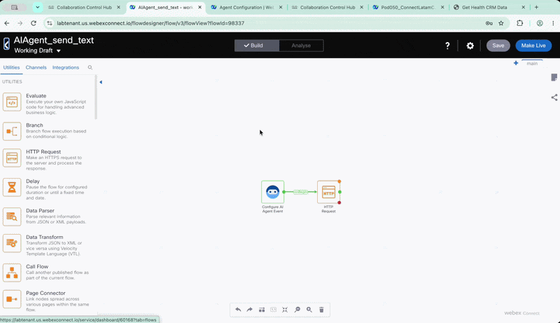{ loading=lazy style="width: 100%; border-radius: 8px; box-shadow: 0 4px 15px rgba(0,0,0,0.2);" }
    </figure>

### 6.6 Agregar el nodo WhatsApp al flow

Ahora agregaremos el nodo `WhatsApp` al flow. Este nodo enviará al paciente un mensaje con el resumen del servicio solicitado.

1. En el panel de nodos del canvas, selecciona la categoría **Channels**.
2. Busca y selecciona el nodo **WhatsApp**.
3. Arrastra el nodo al flow.
4. Conecta la salida `ES` del nodo **Branch** con el nodo **WhatsApp**.

???- tip "Agregar el nodo WhatsApp al flow"
    <figure markdown>
        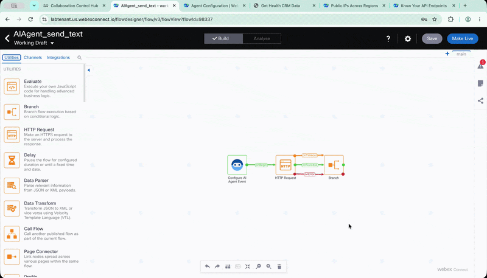{ loading=lazy style="width: 100%; border-radius: 8px; box-shadow: 0 4px 15px rgba(0,0,0,0.2);" }
    </figure>


### 6.7 Configurar WhatsApp en español

1. En el panel de nodos, abre la categoría **Channels**.
2. Selecciona el nodo **WhatsApp**.
3. Colócalo en el canvas.
4. Conecta la rama `ES` con el nodo **WhatsApp**.
5. Abre la configuración del nodo.
6. Cambia el nombre a:

    ```text
    WhatsApp_ES
    ```

7. Configura:

    | Campo | Valor |
    |---|---|
    | **Destination Type** | `WABA ID` |
    | **Destination** | `$(n2.aiAgent.PersonaANI)` |
    | **Message Type** | `TEMPLATE` |
    | **Template Name** | `ciscoconnect_servicerequest_es` |
    | **Parameter Type - Variable 1** | `Text` |
    | **Value - Variable 1** | `$(n2.aiAgent.PersonaName)` |
    | **Parameter Type - Variable 2** | `Text` |
    | **Value - Variable 2** | `$(n2.aiAgent.Message)` |

8. Haz clic en **Save**.

???- tip "Configurar WhatsApp en español"
    <figure markdown>
        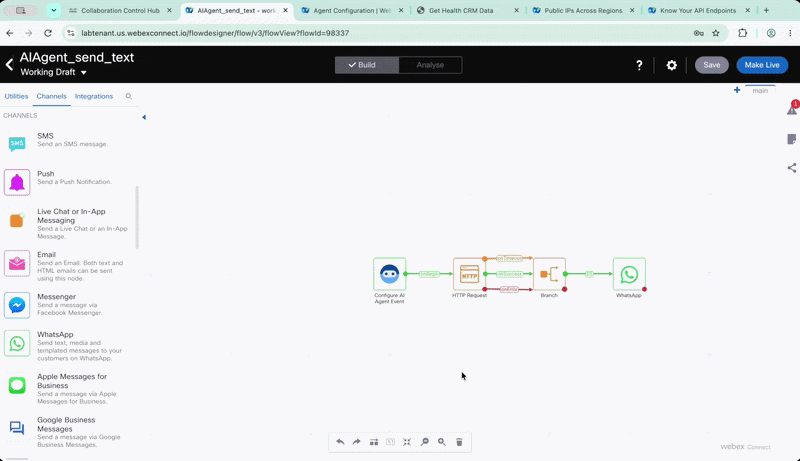{ loading=lazy style="width: 100%; border-radius: 8px; box-shadow: 0 4px 15px rgba(0,0,0,0.2);" }
    </figure>

### 6.8 Configurar WhatsApp en inglés

1. Selecciona el nodo `WhatsApp_ES`.
2. Cópialo y pégalo para crear una copia.
3. Conecta la rama `EN` con el nuevo nodo.
4. Abre la configuración del nodo.
5. Cambia el nombre a:

    ```text
    WhatsApp_EN
    ```

6. Cambia únicamente el siguiente valor:

    | Campo | Valor |
    |---|---|
    | **Template Name** | `ciscoconnect_servicerequest_en` |

    Mantén los demás parámetros configurados previamente.

???- tip "Configurar WhatsApp en inglés"
    <figure markdown>
        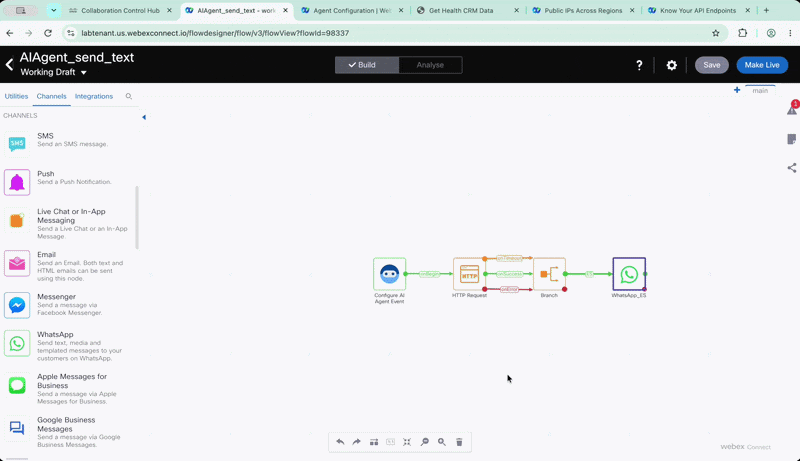{ loading=lazy style="width: 100%; border-radius: 8px; box-shadow: 0 4px 15px rgba(0,0,0,0.2);" }
    </figure>


### 6.9 Configurar el WhatsApp predeterminado

1. Copia nuevamente un nodo **WhatsApp** configurado.
2. Conéctalo a la salida `None of above` del nodo **Branch**.
3. Cambia el nombre a:

    ```text
    WhatsApp_Default
    ```

4. Mantén las configuraciones del nodo copiado.

    !!! note "Ruta predeterminada"
        Si copias el nodo `WhatsApp_ES`, la ruta predeterminada enviará el mensaje utilizando la plantilla en español.

???- tip "Configurar el WhatsApp predeterminado"
    <figure markdown>
        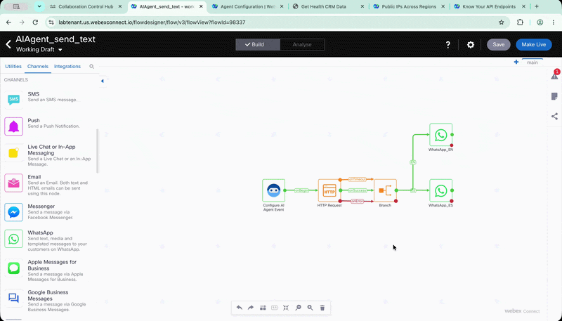{ loading=lazy style="width: 100%; border-radius: 8px; box-shadow: 0 4px 15px rgba(0,0,0,0.2);" }
    </figure>

### 6.10 Configurar Flow Outcomes

1. Abre **Configuration**.
2. Selecciona **Flow Outcomes**.
3. Verifica que **Notify** esté habilitado.
4. Abre **Last Execution Status**.
5. Configura:

    | Campo | Valor |
    |---|---|
    | **Notification Settings** | `Notify AI Agent` |
    | **Define JSON** | `Enter JSON` |

6. Agrega el siguiente JSON:

    ```json
    {
    "transactionID": "$(transid)",
    "flowname": "$(flowname)",
    "serviceName": "$(serviceName)",
    "httpStatus": "$(n4.http.statusCode)",
    "httpResponse": "$(n4.http.responseBody)"
    }
    ```

7. Haz clic en **Save**.

???- tip "Configurar Flow Outcomes"
    <figure markdown>
        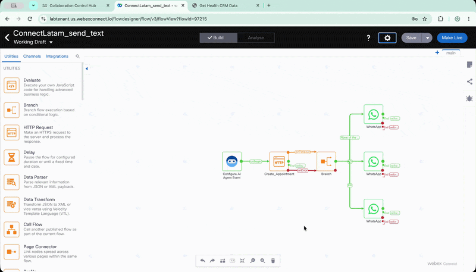{ loading=lazy style="width: 100%; border-radius: 8px; box-shadow: 0 4px 15px rgba(0,0,0,0.2);" }
    </figure>

### 6.11 Publicar el Webex Connect flow

1. En la esquina superior derecha, haz clic en **Make Live**.
2. Si aparece una advertencia indicando que el nodo HTTP no tiene terminación, ignórala.
3. Haz clic nuevamente en **Make Live**.
4. Espera a que el flow termine de publicarse.

El flow estará listo para ser utilizado por el `Cumulus AI Agent`.

## 7. Crear la acción send_text

Regresa a la pestaña de `AI Agent Studio`.

1. Asegúrate de estar en la configuración del `Cumulus AI Agent`.
2. Abre la pestaña **Actions**.
3. Haz clic en **+ Add actions**.
4. Selecciona **Fulfillment** en **Create new action**.
5. Configura:

    | Campo | Valor |
    |---|---|
    | **Action name** | `send_text` |
    | **Action description** | `Send text to patient when finishes the scheduling.` |

!!! warning "Nombres exactos"
    Utiliza exactamente el nombre `send_text` y los nombres de las entidades. El AI Agent utilizará estos valores para identificar la acción correcta.

### 7.1 Crear la entidad PersonaName

1. Haz clic en **+ New input entity**.
2. Configura:

    | Campo | Valor |
    |---|---|
    | **Entity name** | `PersonaName` |
    | **Entity Type** | `String` |
    | **Entity description** | `Set with {{PersonaName}} you had composed during instructions.` |
    | **Required** | Desactivado |

3. Haz clic en **Add**.

### 7.2 Crear las entidades adicionales

1. Agrega las siguientes entidades:

    | Entity name | Entity type | Entity description | Entity examples | Required |
    |---|---|---|---|---|
    | `Language` | `String` | `Use value from {{Global_Language}}. Use es-US if you do not have this information as default.` | `es-US; pt-BR` | Activado |
    | `Message` | `String` | `Summary of the action regarding scheduling, cancellation or rescheduling. Provide a summary including action, location and date using the values from the scheduling completed. Use the correct language according to {{Global_Language}}.` | `Scheduling a medical appointment; agendar una cita médica` | Activado |
    | `PersonaANI` | `String` | `Caller ANI. Use value {{PersonaANI}}. Do not use the phone number returned by get_patient.` | Número de prueba del lab | Activado |

???- tip "Crear la acción send_text"
    <figure markdown>
        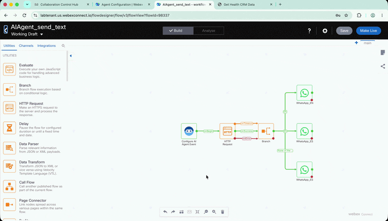{ loading=lazy style="width: 100%; border-radius: 8px; box-shadow: 0 4px 15px rgba(0,0,0,0.2);" }
    </figure>

### 7.3 Configurar el Fulfillment

En la sección **Fulfillment**:

1. Selecciona **Use Webex Connect Flow Builder**.
2. En **Select service**, selecciona el servicio asignado a tu Pod:

    ```text
    PODXXX
    ```

3. En **Select flow**, selecciona:

    ```text
    AIAgent_send_text
    ```

4. Haz clic en **Add**.

## 8. Probar el Cumulus AI Agent

1. Haz clic en **Preview**.
2. Inicia una llamada de prueba.
3. Utiliza el siguiente escenario:

    ```text
    BOT: Centro de Atención al Paciente del Hospital Cumulus. Déjame saber cómo te ayudo hoy.

    PACIENTE: Me gustaría saber si en Cancún hay cardiología.

    BOT: Claro, entiendo tu interés. Sí, en Cancún hay cardiología porque esa sede ofrece todos los servicios y especialidades. Si quieres, después de identificarte puedo revisar tu cita.

    PACIENTE: Sí, por favor.

    BOT: Perfecto. Necesito tu identificación de paciente de tres cifras para continuar.

    PACIENTE: Es 0XX. Usa los tres dígitos de tu Pod ID.

    BOT: Estoy consultando tu expediente de paciente. Un momento, por favor.

    BOT: Gracias. Ahora necesito tu fecha de nacimiento para verificar tu identidad.

    PACIENTE: Es el 1 de enero de 1990.

    BOT: Perfecto, gracias por la información. He entendido el primero de enero de mil novecientos noventa. ¿Me confirmas si es correcta?

    PACIENTE: Sí, es correcta.

    BOT: Gracias. Tu identidad ha quedado verificada. Ya tienes una cita reservada. ¿Quieres mantenerla, cambiarla o cancelarla?

    PACIENTE: Quiero cancelarla.

    BOT: Claro. Estoy cancelando tu cita y dejando constancia en tu expediente. Dame un momento, por favor.

    BOT: Estoy enviando la confirmación de la cancelación de tu cita por mensaje.

    BOT: Tu cita ha quedado cancelada y te he enviado un mensaje de confirmación. ¿Necesitas algo más?

    PACIENTE: No, eso es todo. Gracias.

    BOT: De nada. Que tengas un buen día.
    ```

4. Verifica que el AI Agent:

    - Solicite el `patient ID`.
    - Ejecute `get_patient`.
    - Solicite la fecha de nacimiento.
    - Valide la identidad del paciente.
    - Consulte el estado de la cita.
    - Ejecute `update_patient` cuando corresponda.
    - Ejecute `send_text` después de una actualización exitosa.
    - Utilice la zona horaria del paciente.
    - No exponga información antes de autenticar al paciente.

!!! warning "Publicar el AI Agent"
    Después de finalizar las pruebas en `Preview`, publica el `Cumulus AI Agent` para que pueda utilizarse en el Lab 3.

---

## 🏁 Lab 2 Completado — Felicitaciones! 🎉
Has creado y configurado el `Cumulus AI Agent`, su Knowledge Base, las acciones de MCP Server y la integración con Webex Connect.

---

*Lab realizado para Cisco Connect Latam 2026*