# Lab 2 - Cumulus AI Agent: Gestión de pacientes y citas

---

## Agenda

| # | Actividad | Duración |
|---|---|---|
| 2 | Crear y configurar el `Cumulus AI Agent`, su Knowledge Base, las acciones de MCP Server y la integración con Webex Connect | 40 minutos |

---

## Objetivo

En este lab crearás un segundo AI Agent autónomo para Cumulus Hospital.

El `Cumulus AI Agent` funcionará como un asistente para:

- Responder preguntas generales sobre Cumulus Hospital.
- Consultar información de pacientes.
- Validar la identidad del paciente.
- Consultar y gestionar citas médicas.
- Utilizar acciones de `MCP Server`.
- Enviar confirmaciones mediante un flow de `Webex Connect`.

--- 

## 1. Crear el Cumulus AI Agent

Permanece en la pestaña de `AI Agent Studio`.

1. Haz clic en **+ Create agent**.
2. Selecciona **Start from scratch**.
3. Selecciona **Autonomous**.
4. Configura los siguientes campos:

    | Campo | Valor |
    |---|---|
    | **Agent name** | `PodXXX_ConnectLatam_Cumulus` |
    | **System ID** | Deja el valor generado automáticamente |
    | **AI engine** | `Webex AI Pro-US 2.0` |

    Reemplaza `XXX` por el número de tres dígitos de tu `Pod ID`.

    !!! note "AI engine"
        `Webex AI Pro-US 2.0` se encuentra en etapa Beta para idiomas diferentes al inglés. Sin embargo, proporciona voces y capacidades de lenguaje más modernas para este caso de uso.

5. Haz clic en **Create**.

## 2. Configurar el perfil del agente

Permanece en la pestaña **Profile**.

### 2.1 Configurar AI transparency

1. Desactiva **AI transparency**.
2. En el campo de justificación, escribe:

    ```text
    Lab
    ```

3. Haz clic en **Keep it disabled**.

### 2.2 Configurar el Welcome Message

1. En el campo **Welcome Message**, copie el siguiente texto:

```text
 {{WelcomeMsg}} 
```


!!! note "Welcome Message dinámico"
    `{{WelcomeMsg}}` es una variable que recibe el mensaje inicial enviado desde el `Voice Flow`.

    Esto permite que el AI Agent reciba el mensaje inicial en el idioma seleccionado por el paciente, sin tener que solicitar nuevamente esta información.

## 3. Configurar las Instructions

1. Haga click en la pestaña **Instructions**.
2. Copia y pega el siguiente contenido. Al pegarlo, seleccione **Paste and match style** para que el texto se pegue correctamente. 

    ```text
    Goal: You are a friendly and professional AI healthcare assistant for Cumulus Hospital, focused on answering general clinic questions based on the KB as far as providing patient information about appointments and helping patients manage their scheduled appointments.
    
    INSTRUCTIONS: 
    ## Step 1: MANDATORY INITIAL STEP - DO NOT OFFER ANY INFORMATION OR ACTION BEFORE EXECUTE THIS STEP -  Fetch the Patient Record 
     - After Welcome Message, you MUST INITIALLY  ask for patient Id (you need say something similar to “please provide your patient identification of 3 digits). Confirm if patient had provided 3 digits (ex.: 010). 
    -	If patient provide different information, ask him/her to retry with 3 digits. 
    -	Use the provided 3 digits to compose with value “Pod” in front and use this combination as value of ‘patientId’ (ex: if customer provide “010” the patientId value is “Pod010”).
    
    Execute action `get_patient` using ‘patientId’ and get patient information:
    - If patient not found, inform the caller and ask again.
    - Do not proceed until `get_patient` succeeds with a patient record.
    From  ‘get_patient’, use `firstName``lastName` as name and set variable {{PersonaName}} using this combination. Skip the name when talking to patient if you cannot compose {{PersonaName}}. Thakks patient for the information, use {{PersonaName}} for personalized thank you. Proceed to step 2 bellow.
    
    ## Step 2: Authenticate the Caller (Sequential) - Authenticate using date of birth:
    1. Ask for **date of birth** and compare to record customer information you get from action ‘get_patient’. If wrong, re-ask date of birth.
    - Set `authenticated = true` if  value has matched; `authenticated = false` if fails or the caller declines.
    - Don't provide patient details, scheduling, or updates while `authenticated=false`.
    - Allow up to 3 attempts. Call `Agent_Escalation` if fails.
    
    ## Step 3: Provide Information Only After Authentication
    Once `authenticated = true`:
    - Answer the caller's original request (e.g., appointment status, hospital information based on KB).
    - When patient ask for book an appointment, use information `appointmentStatus`/`nextAppointmentDate` you got from action ‘get_patient’  according:
    . If already `Booked`/`Confirmed`, state that date/time, ask to keep, reschedule, or cancel — never silently book a second one.
    - if ‘Cancelled’ or patient does not have next appointment, continue bellow
    - ask about specialty, location and schedule time required for Book the appointment. ALWAYS use KB to verify valid hour of operation per location and specialty per location required from patient. The patient must inform the location, specialty, date and time and you need to verify if those information are according to KB. Guide the patient according.
    
    ## Step 4: Timezone Handling
    MCP tools always return/expect date-times in **ISO 8601 UTC** (e.g., `2026-07-09T14:30:00.000Z`).
    The patient record includes a `timezone` field (e.g., `America/New_York`) — the source of truth. **Never ask the caller for their timezone** unless missing or null.
    - Convert ISO 8601 UTC into patient's `timezone`, speak naturally (e.g., "Thursday, July 9th at 10:30 AM Eastern Time"), never raw ISO.
    - Interpret caller-given date/time using `timezone`, convert to ISO 8601 UTC (`Z`) before any MCP call, confirm back in local time.
    
    ## Step 5: Update Restrictions (PII Guardrail)
    - `update_patient` may only touch `nextAppointmentDate`/`appointmentStatus`. DO NOT update others parameters.
    - **Cancel:** set `appointmentStatus`=`Cancelled` AND `nextAppointmentDate`=null together — never leave the old date.
    - **Book/Reschedule:** set `nextAppointmentDate` to the new ISO time AND `appointmentStatus`=`Booked` together.
    Continue
    
    ## Step 6: Text Appointment Confirmation
    After a **booking, cancellation, or update** via `update_patient` succeeds, execute action `send_text` to the patient's using {{PersonaANI}}. DO NOT use ‘phoneNumber’ .
    - One SMS per successful change; never on failures.
    - Message states action/date/time in `timezone`, never raw ISO.
    - If `send_text` fails, tell caller the appointment saved but text failed.
    
    ## General Behavior
    - If `get_patient` errors, inform the caller politely; call `Agent_Escalation`. Don't attempt authentication.
    - Never guess/fabricate date of birth, zip, or patient data — verify against MCP response.
    - If a caller asks for a representative/an expert or a human agent, call the action`Agent_Escalation` to allow patient be transfered.
    - `Agent_Escalation` is callable, not narration — invoke it
    - Always provide a personalized attention using {{PersonaName}} to say patient name
    
    ## Example Flow
    1. Caller: "I want to book an appointment."
    2. Agent calls `get_patient`, then asks date of birth to authenticate him/her
    3. If ` nextAppointmentDate’  has valid information (not null) → states that date/time, asks to keep, reschedule, or cancel.
    4. Once confirmed → `update_patient` (elapsed time, KB checked), confirms local, specialty and date/time, calls `send_text`.
    5. IF customer wants to be trasnferred to a human, invoke action 'Agent_Escalation'
    ```
    3. Haz clic en **Save changes**.

    !!! note "Idioma de Goal e Instructions"
        Para facilitar el soporte de los proctors en este caso de uso multilingüe, el contenido de los campos `Goal` e `Instructions` se mantiene en inglés.

        Sin embargo, en un entorno de producción estos campos pueden configurarse completamente en español sin ningún problema.

## 4. Crear el Knowledge Base

Descarga el archivo utilizado para configurar el Knowledge Base:
    <a href="../assets/ConnectLatam_AIAgentCumulusKB.pdf"
       target="_blank"
       rel="noopener noreferrer">
       Descargar ConnectLatam_AIAgentCumulusKB.pdf
    </a>

Este documento contiene información general sobre Cumulus Hospital, incluyendo:
- Ubicaciones.
- Especialidades.
- Horarios de atención.
- Información general de los servicios.

1. Regresa a la configuración del `Cumulus AI Agent`.
2. Abre la pestaña **Knowledge**.
3. Haz clic en **Select a Knowledge Base**.
4. Selecciona **+ Create knowledge base**.
5. Configura el nombre:

    ```text
    PodXXX_CumulusKB
    ```

6. Haz clic en **Create**.
7. Espera a que el Knowledge Base sea creado.
8. Haz clic en **Upload Files**.
9. Selecciona **Add file**.
10. Selecciona el archivo `ConnectLatam_AIAgentCumulusKB.pdf`.
11. Haz clic en **Open**.
12. Haz clic en **Process Files**.
13. Espera a que el archivo termine de procesarse.
14. Cierra la ventana de carga.
15. Cierra la ventana del Knowledge Base para regresar a la configuración del AI Agent.

    ???- tip "Cómo configurar el Knowledge Base del Cumulus AI Agent"
        <figure markdown>
            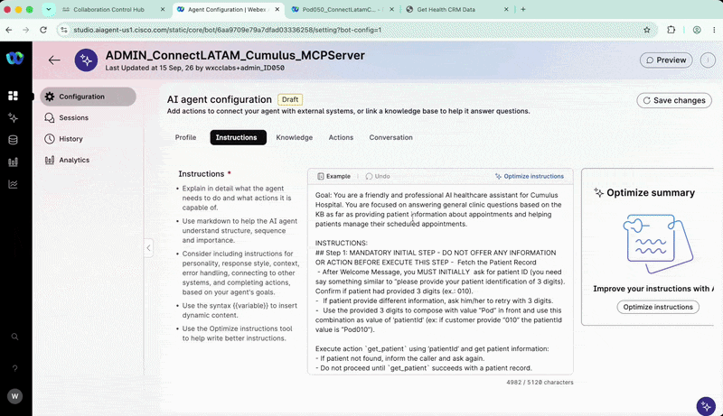{ loading=lazy style="width: 100%; border-radius: 8px; box-shadow: 0 4px 15px rgba(0,0,0,0.2);" }
        </figure>

## 5. Configurar las acciones de MCP Server

1. Haz clic en **Save changes**.
2. Abre la pestaña **Actions**.
3. Desactiva **Agent handover**.
4. Haz clic en **+ Add actions**.
5. Selecciona **Select available**.
6. Selecciona **Browser actions** y en el buscador, escribe:

    ```text
    cumulus
    ```

7. Selecciona únicamente:

    ```text
    get_patient
    update_patient
    ```
8. Haz clic en **Añadir**

    !!! warning "Acciones requeridas"
        Selecciona únicamente `get_patient` y `update_patient`. Estas son las acciones de MCP Server utilizadas en este lab.

???- tip "Cómo configurar las acciones de MCP Server"
    <figure markdown>
        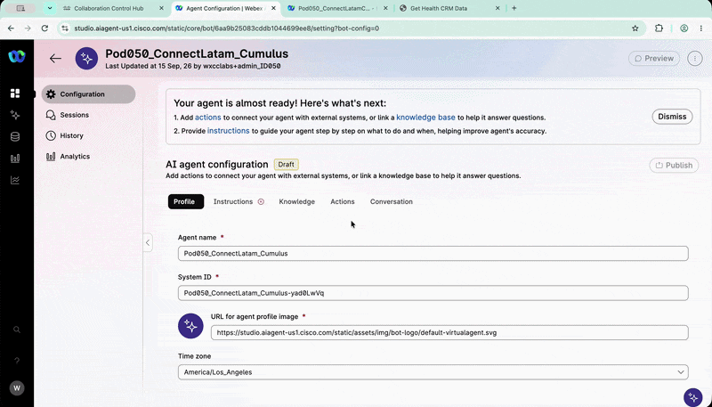{ loading=lazy style="width: 100%; border-radius: 8px; box-shadow: 0 4px 15px rgba(0,0,0,0.2);" }
    </figure>

## 6. Crear el Webex Connect flow

En esta actividad crearás el flow `AIAgent_send_text`. Este flow enviará al paciente la confirmación de la acción realizada por el AI Agent.

### 6.1 Abrir Webex Connect

1. Regresa a `Control Hub`.
2. Navega a **Services > Contact Center**.
3. En la sección **Quick Links**, ubica **Webex Connect**.
4. Haz clic en **Webex Connect**.
5. En Webex Connect, abre el menú **Services**.
6. Busca el servicio asignado a tu Pod utilizando:

    ```text
    PodXXX
    ```

7. Selecciona el servicio correspondiente.

    ???- tip "Cómo abrir Webex Connect"
        <figure markdown>
            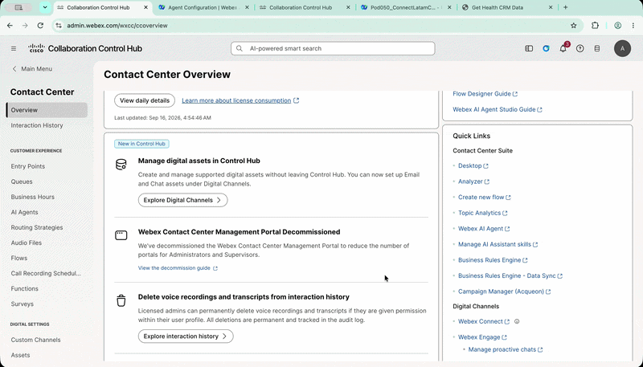{ loading=lazy style="width: 100%; border-radius: 8px; box-shadow: 0 4px 15px rgba(0,0,0,0.2);" }
        </figure>

### 6.2 Crear el flow

1. Dentro de tu servicio, abre **Flows**.
2. Haz clic en **Create Flow**.
3. Configura:

    | Campo | Valor |
    |---|---|
    | **Flow Name** | `AIAgent_send_text` |
    | **Method** | `New Flow` |
    | **Template** | `Start from Scratch` |

4. Haz clic en **Create**.

???- tip "Crear el Webex Connect flow"
    <figure markdown>
        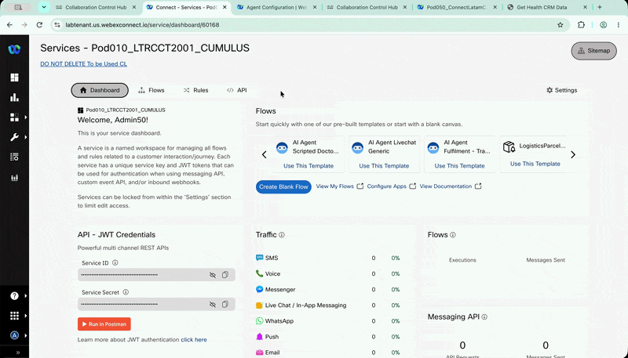{ loading=lazy style="width: 100%; border-radius: 8px; box-shadow: 0 4px 15px rgba(0,0,0,0.2);" }
    </figure>

### 6.3 Configurar el AI Agent Event

1. En la ventana **Integrations**, selecciona **AI Agent**.
2. En **Configure AI Agent Event**, Copia el siguiente JSON y remplaza el existente.

    ```json
    {
    "PersonaName": "Eliane Gasparotto",
    "Language": "es-US",
    "PersonaANI": "5511992518520",
    "Message": "Cita confirmada"
    }
    ```
3. Haz clic en **Parse**.
4. Haz clic en **Save**.


!!! note "Valores de prueba"
    Utiliza los valores de prueba proporcionados para el ambiente del lab. No utilices información real de pacientes.

???- tip "Configurar el AI Agent Event"
    <figure markdown>
        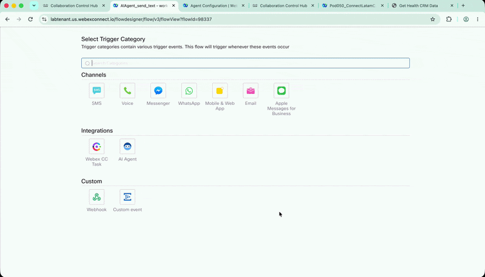{ loading=lazy style="width: 100%; border-radius: 8px; box-shadow: 0 4px 15px rgba(0,0,0,0.2);" }
    </figure>

### 6.4 Configurar el HTTP Request

1. Agrega un nodo **HTTP Request** al canvas.
2. Colócalo junto al nodo **AI Agent**.
3. Conecta el nodo **AI Agent Event** con el nodo **HTTP Request**.
4. Abre la configuración del nodo **HTTP Request**.
5. Configura los siguientes valores:

    | Campo | Valor |
    |---|---|
    | **Method** | `POST` |
    | **Endpoint URL** | `https://hooks.us.webexconnect.io/events/3V12KFWSBD` |
    | **Header** | `Content-Type` |
    | **Value** | `application/json` |
    | **Connection Timeout** | `5000` |
    | **Request Timeout** | `5000` |

    En el campo **Body**, agrega:

    ```json
    {
    "PersonaName": "$(n2.aiAgent.PersonaName)",
    "Language": "$(n2.aiAgent.Language)",
    "PersonaANI": "$(n2.aiAgent.PersonaANI)",
    "Message": "$(n2.aiAgent.Message)"
    }
    ```

6. Haz clic en **Save**.

???- tip "Configurar el HTTP Request"
    <figure markdown>
        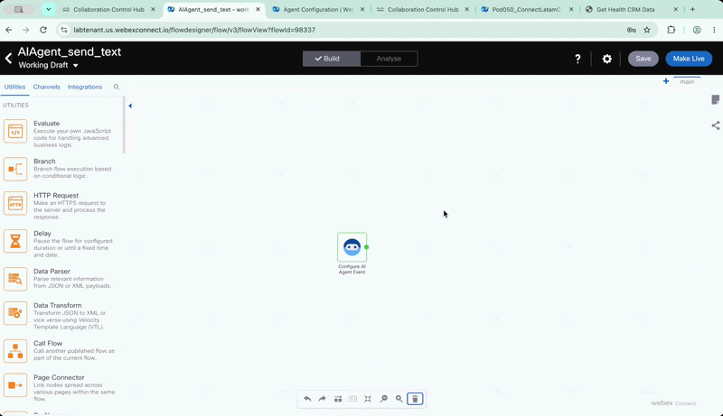{ loading=lazy style="width: 100%; border-radius: 8px; box-shadow: 0 4px 15px rgba(0,0,0,0.2);" }
    </figure>

### 6.5 Configurar el Branch

1. Agrega un nodo **Branch** al canvas.
2. Conecta el nodo **HTTP Request** con el nodo **Branch**.
3. Conecta todas las salidas del nodo **HTTP Request**.
4. Configura las ramas:

    | Nombre | Variable | Condition |  Value |
    |---|---|---|---|
    | `ES` | aiAgent.language | equals ingnore case | Español |
    | `ES` | aiAgent.language | equals ingnore case | Ingles |
    | `None of above` |  |  | Ruta predeterminada |

???- tip "Configurar el Branch"
    <figure markdown>
        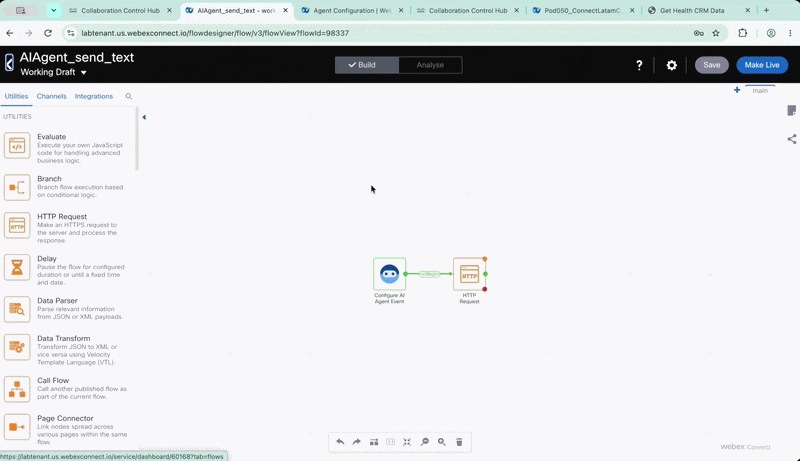{ loading=lazy style="width: 100%; border-radius: 8px; box-shadow: 0 4px 15px rgba(0,0,0,0.2);" }
    </figure>


### 6.6 Configurar WhatsApp en español

1. En el panel de nodos, abre la categoría **Channels**.
2. Selecciona el nodo **WhatsApp**.
3. Colócalo en el canvas.
4. Conecta la rama `ES` con el nodo **WhatsApp**.

    ???- tip "Agregar el nodo WhatsApp español al flow"
        <figure markdown>
            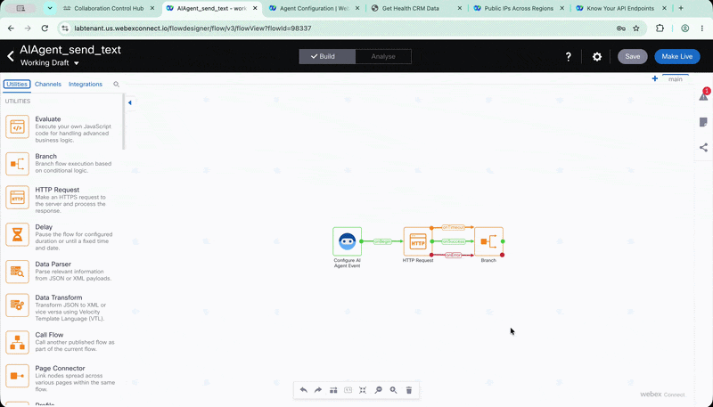{ loading=lazy style="width: 100%; border-radius: 8px; box-shadow: 0 4px 15px rgba(0,0,0,0.2);" }
        </figure>
5. Abre la configuración del nodo.
6. Cambia el nombre a:

    ```text
    WhatsApp_ES
    ```

7. Configura:

    | Campo | Valor |
    |---|---|
    | **Destination Type** | `WABA ID` |
    | **Destination** | `$(n2.aiAgent.PersonaANI)` |
    | **Message Type** | `TEMPLATE` |
    | **Template Name** | `ciscoconnect_servicerequest_es` |
    | **Parameter Type - Variable 1** | `Text` |
    | **Value - Variable 1** | `$(n2.aiAgent.PersonaName)` |
    | **Parameter Type - Variable 2** | `Text` |
    | **Value - Variable 2** | `$(n2.aiAgent.Message)` |

8. Haz clic en **Save**.

???- tip "Configurar WhatsApp en español"
    <figure markdown>
        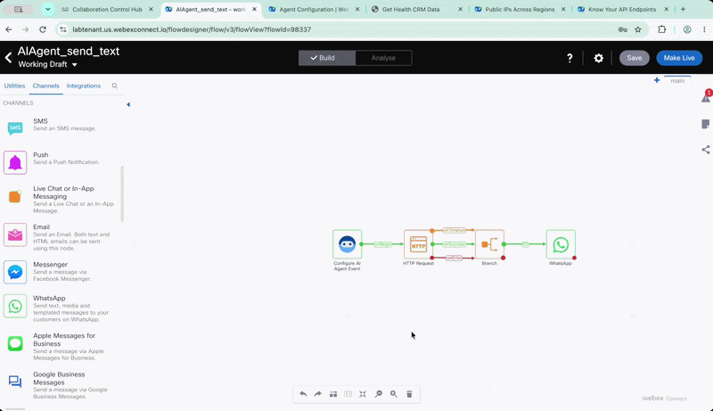{ loading=lazy style="width: 100%; border-radius: 8px; box-shadow: 0 4px 15px rgba(0,0,0,0.2);" }
    </figure>

### 6.7 Configurar WhatsApp en inglés

1. Selecciona el nodo `WhatsApp_ES`.
2. Cópialo y pégalo para crear una copia.
3. Conecta la rama `EN` con el nuevo nodo.
4. Abre la configuración del nodo.
5. Cambia el nombre a:

    ```text
    WhatsApp_EN
    ```

6. Cambia únicamente el siguiente valor:

    | Campo | Valor |
    |---|---|
    | **Template Name** | `ciscoconnect_servicerequest_en` |

    Configurar los demás parámetros de acuerdo al ítem anterior de WhatsApp_ES.

???- tip "Configurar WhatsApp en inglés"
    <figure markdown>
        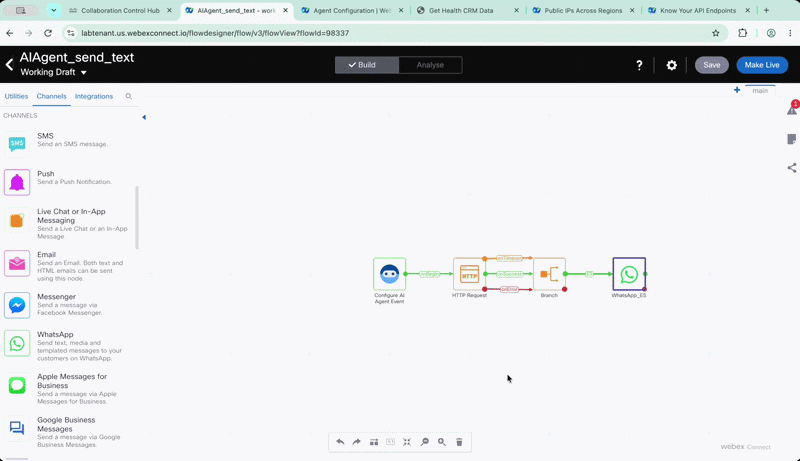{ loading=lazy style="width: 100%; border-radius: 8px; box-shadow: 0 4px 15px rgba(0,0,0,0.2);" }
    </figure>


### 6.8 Configurar el WhatsApp predeterminado

1. Copia nuevamente un nodo **WhatsApp** configurado.
2. Conéctalo a la salida `None of above` del nodo **Branch**.
3. Cambia el nombre a:

    ```text
    WhatsApp_Default
    ```

4. Mantén las configuraciones del nodo copiado.

    !!! note "Ruta predeterminada"
        Si copias el nodo `WhatsApp_ES`, la ruta predeterminada enviará el mensaje utilizando la plantilla en español.

???- tip "Configurar el WhatsApp predeterminado"
    <figure markdown>
        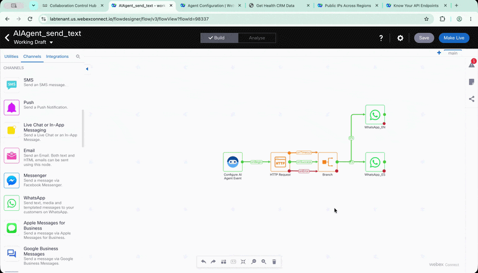{ loading=lazy style="width: 100%; border-radius: 8px; box-shadow: 0 4px 15px rgba(0,0,0,0.2);" }
    </figure>

### 6.9 Configurar Flow Outcomes

1. Abre **Configuration**.
2. Selecciona **Flow Outcomes**.
3. Verifica que **Notify** esté habilitado.
4. Abre **Last Execution Status**.
5. Configura:

    | Campo | Valor |
    |---|---|
    | **Notification Settings** | `Notify AI Agent` |
    | **Define JSON** | `Enter JSON` |

6. Agrega el siguiente JSON:

    ```json
    {
    "transactionID": "$(transid)",
    "flowname": "$(flowname)",
    "serviceName": "$(serviceName)",
    "httpStatus": "$(n4.http.statusCode)",
    "httpResponse": "$(n4.http.responseBody)"
    }
    ```

7. Haz clic en **Save**.

???- tip "Configurar Flow Outcomes"
    <figure markdown>
        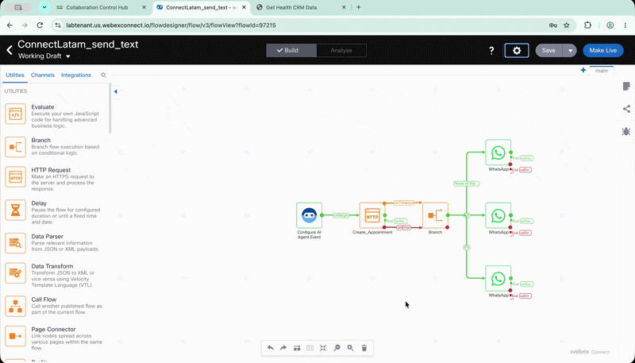{ loading=lazy style="width: 100%; border-radius: 8px; box-shadow: 0 4px 15px rgba(0,0,0,0.2);" }
    </figure>

### 6.10 Publicar el Webex Connect flow

1. En la esquina superior derecha, haz clic en **Make Live**.
2. Si aparece una advertencia indicando que el nodo HTTP no tiene terminación, ignórala.
3. Seleciona **Cisdemo 2** en Application.
4. Haz clic nuevamente en **Make Live**.
5. Espera a que el flow termine de publicarse.

El flow estará listo para ser utilizado por el `Cumulus AI Agent`.

## 7. Crear la acción send_text

Regresa a la pestaña de `AI Agent Studio`.

1. Asegúrate de estar en la configuración del `Cumulus AI Agent`.
2. Abre la pestaña **Actions**.
3. Haz clic en **+ Add actions**.
4. Selecciona **Fulfillment**. 
5. Configura con la siguiente información:

    | Campo | Valor |
    |---|---|
    | **Action name** | `send_text` |
    | **Action description** | `Send text to patient when finishes the scheduling.` |

!!! warning "Nombres exactos"
    Utiliza exactamente el nombre `send_text` y los nombres de las entidades. El AI Agent utilizará estos valores para identificar la acción correcta.

### 7.1 Crear la entidad PersonaName

1. Haz clic en **+ New input entity**.
2. Configura:

    | Campo | Valor |
    |---|---|
    | **Entity name** | `PersonaName` |
    | **Entity Type** | `String` |
    | **Entity description** | `Set with {{PersonaName}} you had composed during instructions.` |
    | **Required** | Desactivado |

3. Haz clic en **Add**.

### 7.2 Crear las entidades adicionales

1. Agrega las siguientes entidades:

    | Entity name | Entity type | Entity description | Entity examples | Required |
    |---|---|---|---|---|
    | `Language` | `String` | `Use value from {{Global_Language}}. Use es-US if you do not have this information as default.` | `es-US; en-US` | Activado |
    | `Message` | `String` | `Summary of the action regarding scheduling, cancellation or rescheduling. Provide a summary including action, location and date using the values from the scheduling completed. Use the correct language according to {{Global_Language}}.` | `Scheduling a medical appointment; agendar una cita médica` | Activado |
    | `PersonaANI` | `String` | `Caller ANI. Use value {{PersonaANI}}. Do not use the phone number returned by get_patient.` | Número de prueba del lab | Activado |


### 7.3 Configurar el Fulfillment

En la sección **Fulfillment**:

1. Selecciona **Use Webex Connect Flow Builder**.
2. En **Select service**, selecciona el servicio asignado a tu Pod:

    ```text
    PODXXX
    ```

3. En **Select flow**, selecciona:

    ```text
    AIAgent_send_text
    ```

4. Haz clic en **Add**.

???- tip "Crear la acción send_text"
    <figure markdown>
        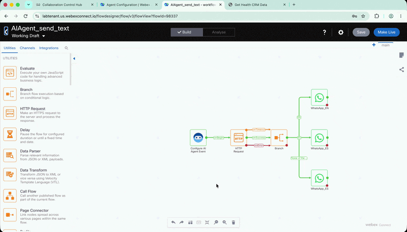{ loading=lazy style="width: 100%; border-radius: 8px; box-shadow: 0 4px 15px rgba(0,0,0,0.2);" }
    </figure>

## 8. Probar el Cumulus AI Agent

!!! note "Idioma de la conversación en Preview en el AI Agent Studio"
    Por defecto el AI Agent viene configurado en idioma inglés, por lo que si no se hacen cambios esta primera prueba será en Ingles, esto es un comportamiento **Normal**. <br>
    Si se desea hacer la prueba en **Español**, se debe Ir al menú de "Conversation" y selecionar el idioma "Spanish es-US" y luego seleccionar una voz de las disponibles para este idioma. 

1. Haz clic en **Preview**.
2. Inicia una llamada de prueba.
3. Utiliza el siguiente escenario:

    ```text
    BOT: Centro de Atención al Paciente del Hospital Cumulus. Déjame saber cómo te ayudo hoy.

    PACIENTE: Me gustaría saber si en Cancún hay cardiología.

    BOT: Claro, entiendo tu interés. Sí, en Cancún hay cardiología porque esa sede ofrece todos los servicios y especialidades. Si quieres, después de identificarte puedo revisar tu cita.

    PACIENTE: Sí, por favor.

    BOT: Perfecto. Necesito tu identificación de paciente de tres cifras para continuar.

    PACIENTE: Es 0XX. Usa los tres dígitos de tu Pod ID.

    BOT: Estoy consultando tu expediente de paciente. Un momento, por favor.

    BOT: Gracias. Ahora necesito tu fecha de nacimiento para verificar tu identidad.

    PACIENTE: Es el 1 de enero de 1990.

    BOT: Perfecto, gracias por la información. He entendido el primero de enero de mil novecientos noventa. ¿Me confirmas si es correcta?

    PACIENTE: Sí, es correcta.

    BOT: Gracias. Tu identidad ha quedado verificada. Ya tienes una cita reservada. ¿Quieres mantenerla, cambiarla o cancelarla?

    PACIENTE: Quiero cancelarla.

    BOT: Claro. Estoy cancelando tu cita y dejando constancia en tu expediente. Dame un momento, por favor.

    BOT: Estoy enviando la confirmación de la cancelación de tu cita por mensaje.

    BOT: Tu cita ha quedado cancelada y te he enviado un mensaje de confirmación. ¿Necesitas algo más?

    PACIENTE: No, eso es todo. Gracias.

    BOT: De nada. Que tengas un buen día.
    ```

4. Verifica que el AI Agent:

    - Solicite el `patient ID`.
    - Ejecute `get_patient`.
    - Solicite la fecha de nacimiento.
    - Valide la identidad del paciente.
    - Consulte el estado de la cita.
    - Ejecute `update_patient` cuando corresponda.
    - Ejecute `send_text` después de una actualización exitosa. **Nota:** esta acción no se realizará **aún**, ya que no se tiene el **ANI** correspondiente en este momento.
    - Utilice la zona horaria del paciente.
    - No exponga información antes de autenticar al paciente.

!!! warning "Publicar el AI Agent"
    Después de finalizar las pruebas en `Preview`, publica el `Cumulus AI Agent` para que pueda utilizarse en el Lab 3.

---

## 🏁 Lab 2 Completado — Felicitaciones! 🎉
Has creado y configurado el **Cumulus AI Agent**, su **Knowledge Base**, las **acciones de MCP Server* y la **integración con Webex Connect**.

---

*Lab realizado para Cisco Connect Latam 2026*