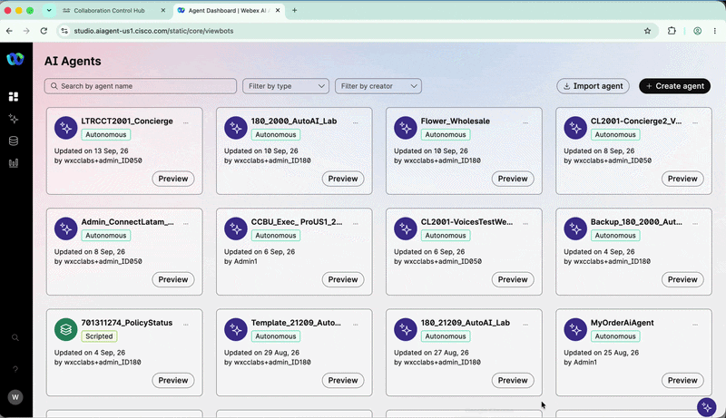
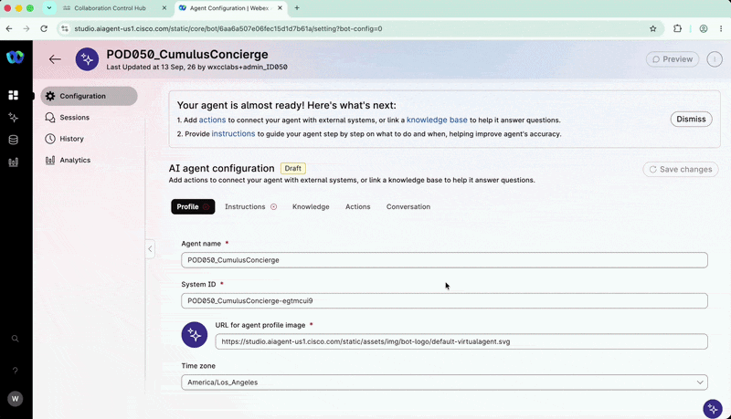
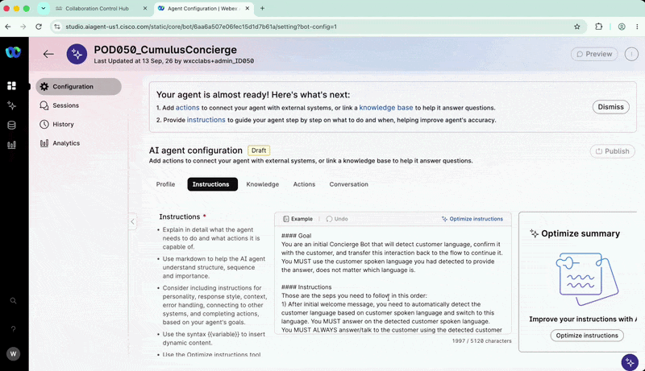
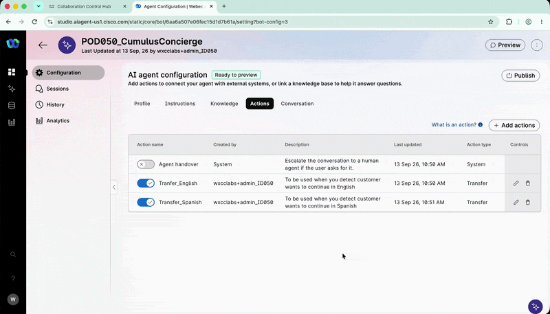
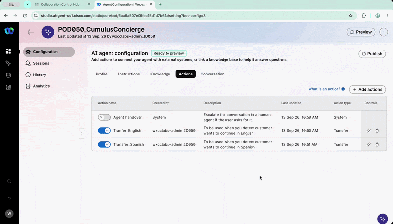

# Lab 1 - Concierge AI Agent - Atención bilingüe

---

## Section Agenda
| # | Task | Duration |
|---|---|---|
| 1 | Crear el AI Agent autónomo `Concierge` para detectar el idioma del paciente | 20 min |

---

## Objetivo

En este lab crearás desde cero un AI Agent autónomo utilizando `AI Agent Studio`.

El agente, llamado **Concierge**, identificará si el paciente desea continuar la conversación en español o en inglés y transferirá la interacción al flujo correspondiente.

???+ warning "Disciplina del Pod ID"
    Reemplace siempre `XXX` por su POD_ID de tres dígitos asignado, por ejemplo: `001` o `002`. La convención de nombres debe comenzar con el prefijo `Pod`, seguido de su `Pod ID`: `PodXXX`. **Si no sigue exactamente esta convención, podría sobrescribir el trabajo de otro participante**

---

## 1. Acceder a AI Agent Studio

1. Abra Google Chrome utilizando el perfil `Admin_Lab`.
2. Ingrese a [Control Hub](https://admin.webex.com/).
3. Inicie sesión con las credenciales de `Administrator` asignadas a su Pod.

    ???- tip "Cómo acceder a Control Hub"
        <figure markdown>
            { loading=lazy style="width: 100%; border-radius: 8px; box-shadow: 0 4px 15px rgba(0,0,0,0.2);" }
        </figure>

4. En el panel izquierdo de `Control Hub`, seleccione **Services**.
5. Haga clic en **Contact Center**.
6. En la página principal, ubique la sección **Quick Links**.
7. Haga clic en **Webex AI Agent**.

    ???- tip "Cómo acceder AI Agent"
        <figure markdown>
            { loading=lazy style="width: 100%; border-radius: 8px; box-shadow: 0 4px 15px rgba(0,0,0,0.2);" }
        </figure>

8. Se abrirá `AI Agent Studio` en una nueva pestaña del navegador.


## 2. Crear el Concierge AI Agent

1. En `AI Agent Studio`, haga clic en **+ Create agent**.
2. Seleccione **Start from scratch**.
3. Haga clic en **Next**.
4. En el tipo de agente, seleccione **Autonomous**.
5. Configure los siguientes valores:

    | Campo | Valor |
    |---|---|
    | **Agent name** | `PodXXX_ConnectLatam_Concierge` |
    | **System ID** | Deje el valor generado automáticamente |
    | **AI engine** | `Webex AI Speech-to-Speech 1.0` |

    ???+ warning "Recordatorio"
    Reemplace `XXX` por el número de tres dígitos de su `Pod ID`.

6. Haga clic en **Create**. 

???- tip "Cómo crear el Concierge AI Agent"
    <figure markdown>
        { loading=lazy style="width: 100%; border-radius: 8px; box-shadow: 0 4px 15px rgba(0,0,0,0.2);" }
    </figure>

## 3. Configurar el perfil del agente

Después de crear el agente, permanezca en la pestaña **Profile**.

### 3.1 Configurar AI transparency

1. Ubique la opción **AI transparency**.
2. Desactívela.
3. En el campo de justificación, escriba: ```text Lab```
4. Haga clic en **Keep it disabled**.

    ### 3.2 Configurar el Welcome Message

5. En el campo **Welcome Message**, copie el siguiente texto:

    ```text
    Gracias por contactar al Hospital Cumulus. Déjame saber si prefieres continuar esta interacción en español o en inglés.
    ```

6. Haga clic en **Save changes**.

## 4. Configurar las Instrucciones

1. Abra la pestaña **Instructions**.
2. Copie y pegue el siguiente contenido.
3. Al pegarlo, seleccione **Paste and match style**.


    ```text
    #### Goal

    You are an initial Concierge Bot that detects the customer's language, confirms it, and transfers the interaction back to the flow to continue. You MUST use the customer's detected spoken language when responding, regardless of which language it is.

    #### Instructions

    Follow these steps in this order:

    1. After the initial welcome message, automatically detect the customer's language based on their spoken language and switch to that language.

    You MUST ALWAYS answer and speak to the customer using the detected spoken language.

    - If the spoken language is Spanish, go to the action [Transfer_Spanish]. Do not say anything else; just transfer.
    - If the spoken language is English, go to the action [Transfer_English]. Do not say anything else; just transfer.
    - If the spoken language is different from English or Spanish, respond in the detected spoken language and explain that this lab is prepared only for Spanish and English. Ask the customer which of these two languages they would like to use.
    - If the customer insists on using a language other than English or Spanish, explain in the customer's spoken language that you will continue in English, then use the action [Transfer_English].

    #### GENERAL GUIDELINES

    Always answer the customer using the detected language, even if it is not English or Spanish.

    Maintain a professional and empathetic tone consistent with a hospital concierge who is assisting patients.

    Do not offer additional services. If the customer asks about a service or topic unrelated to your goal, try to return the conversation to the language selection process.

    If, after two attempts, the customer has not selected English or Spanish, explain in the customer's spoken language that you will transfer the call to continue in English, then use the action [Transfer_English].
    ```

4. Haga clic en **Save changes**.

    !!! note "Idioma de Instrucciones"

        Para facilitar el soporte de los proctors en este caso de uso multilingüe, el contenido del campo instrucciones con el `Objetivo` e `Instrucciones` y `Guía` se mantiene en inglés.

        Sin embargo, en un entorno de producción estos campos pueden configurarse completamente en español, de acuerdo con las necesidades del negocio y el idioma de atención seleccionado.

## 5. Configurar el idioma y la voz

1. Abra la pestaña **Conversation**.
2. Configure únicamente las siguientes opciones:

    | Campo | Valor |
    |---|---|
    | **Language** | `Spanish (US) es-US` |
    | **Select voice** | `es-US-Elena` |

3. Haga clic en **Save changes**.

    ???- tip "Cómo configurar el Concierge AI Agent"
        <figure markdown>
            { loading=lazy style="width: 100%; border-radius: 8px; box-shadow: 0 4px 15px rgba(0,0,0,0.2);" }
        </figure>

## 6. Crear las acciones de transferencia

1. Abra la pestaña **Actions**.
2. Desactive la acción predeterminada **Agent handover**.

!!! note "Transferencia del Concierge"

    El Concierge no realizará escalaciones hacia agentes humanos. En su lugar, utilizará acciones específicas para transferir la llamada de regreso al `flow` según el idioma seleccionado por el paciente.

### 6.1 Crear Transfer_English

1. Haga clic en **+ Add actions**.
2. En **Add new**, seleccione **Transfer**.
3. Configure los siguientes valores:

    | Campo | Valor |
    |---|---|
    | **Action name** | `Transfer_English` |
    | **Transfer condition** | `To be used when you detect customer wants to continue in English` |

4. Haga clic en **Add**.

### 6.2 Crear Transfer_Spanish

1. Repita el procedimiento anterior con los siguientes valores:

    | Campo | Valor |
    |---|---|
    | **Action name** | `Transfer_Spanish` |
    | **Transfer condition** | `To be used when you detect customer wants to continue in Spanish` |

2. Haga clic en **Add**.

!!! warning "Nombres exactos"

    Utilice exactamente los nombres `Transfer_English` y `Transfer_Spanish`. No agregue espacios, caracteres adicionales ni cambie las mayúsculas.

???- tip "Cómo configurar las acciones del AI Agent Concierge"
    <figure markdown>
        { loading=lazy style="width: 100%; border-radius: 8px; box-shadow: 0 4px 15px rgba(0,0,0,0.2);" }
    </figure>

## 7. Probar el Concierge en Preview

Antes de publicar el agente, pruébelo utilizando `Preview`.

1. Haga clic en **Preview** en la parte superior de `AI Agent Studio`.
2. En la ventana emergente, haga clic en **Start a call**.
3. Utilice audífonos para reducir el ruido y evitar afectar a otros participantes.
4. Pruebe algunas de las siguientes frases:

```text
Yo quiero continuar en Español.
```

```text
Quiero interactuar en Español.
```

```text
I want to talk in English, please.
```

???- tip "Pruebas en Español AI Agent Concierge"
    <figure markdown>
        { loading=lazy style="width: 100%; border-radius: 8px; box-shadow: 0 4px 15px rgba(0,0,0,0.2);" }
    </figure>

Verifique que:

- El agente reproduzca correctamente el `Welcome Message`.
- Detecte el idioma utilizado.
- Ejecute `Transfer_Spanish` cuando el paciente seleccione español.
- Ejecute `Transfer_English` cuando el paciente seleccione inglés.

!!! note "Idiomas disponibles"

    Aunque el Concierge puede interactuar en otros idiomas, en este lab se configurarán únicamente español e inglés, utilizando las dos acciones de transferencia creadas anteriormente.

## 8. Publicar el Concierge

Cuando finalice las pruebas:

1. Haga clic en **Publish**.
2. Ingrese una nota para identificar la versión, por ejemplo:

```text
Lab 1 - Concierge AI Agent
```
3. Confirme la publicación.

???- tip "Cómo publicar el Concierge AI Agent"
    <figure markdown>
        { loading=lazy style="width: 100%; border-radius: 8px; box-shadow: 0 4px 15px rgba(0,0,0,0.2);" }
    </figure>

---
!!! success "Lab 1 completado"

    Ha creado, configurado, probado y publicado el `Concierge AI Agent`.


## 🏁 Lab 1 Completado — Felicitaciones! 🎉

Usted  ha creado, configurado, probado y publicado el **Concierge AI Agent**.

---

*Lab realizado para Cisco Connect Latam 2026*